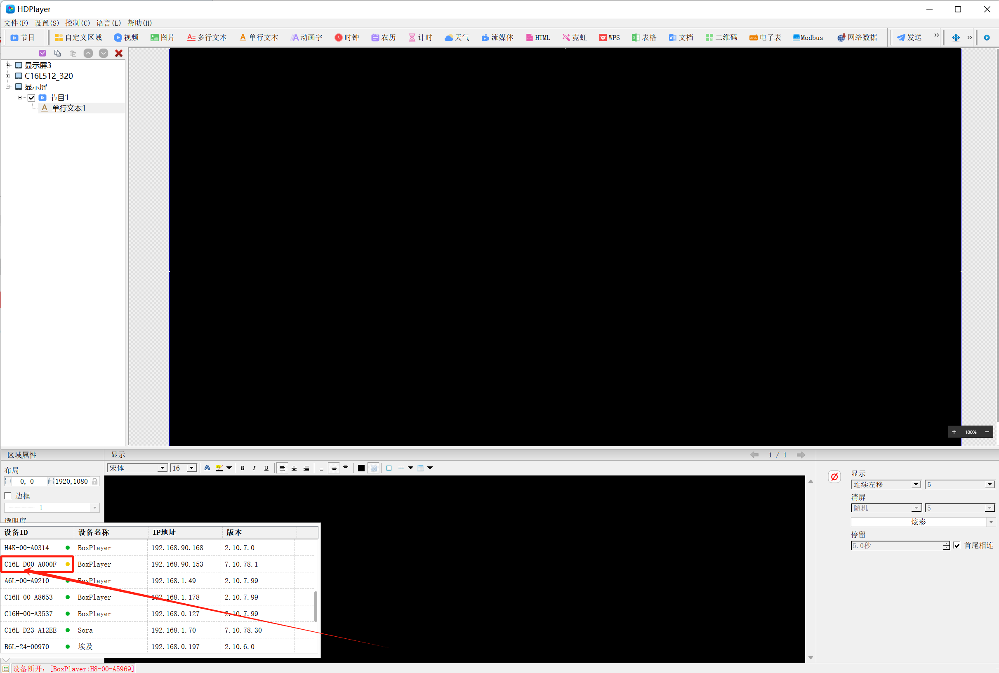
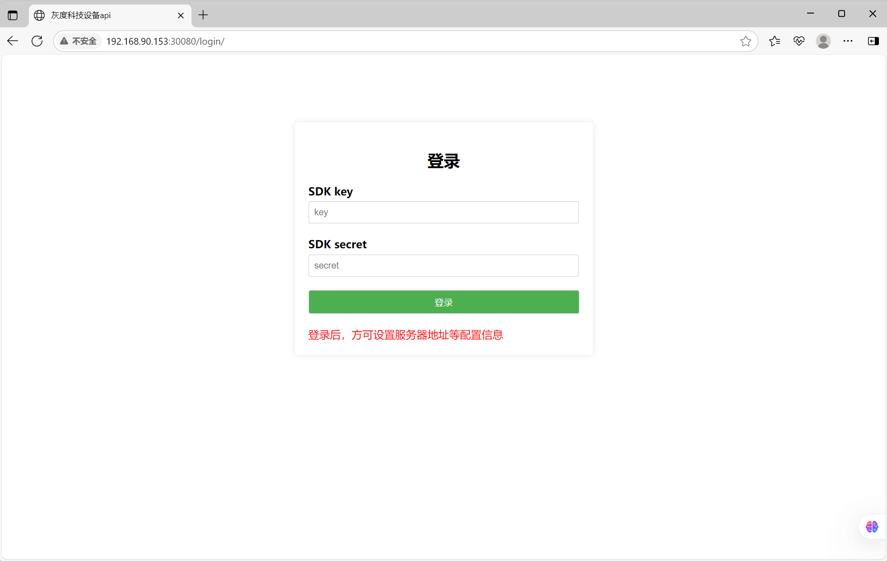
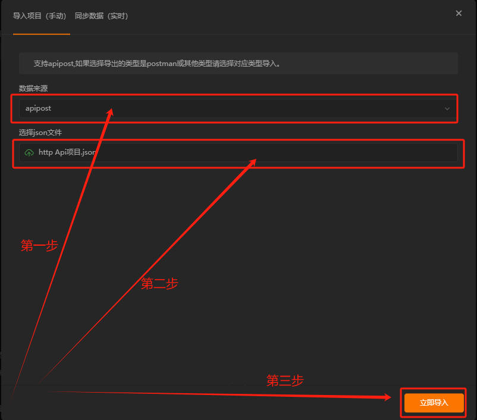

# 深圳市灰度科技有限公司设备HTTP API说明


# 1 文档简介

## 1.1 阅读对象
贵公司的技术部门的开发、维护及管理人员，应具备以下基本知识：
1. 了解HTTPS/HTTP协议等内容。
2. 了解信息安全的基本概念。
3. 了解计算机至少一种编程语言。

## 1.2 产品概述
本开发手册对该系统功能接口进行详细的描述，通过该指南可以对本系统有全面的了解，使技术人员尽快掌握本系统的接口，并能够在本系统上进行开发。
灰度科技的设备二次开发，流程图如下

 **通过SDK访问网关服务（ubuntu/windows）来控制设备** 


 **通过SDK直接访问设备** 


## 1.3 目录结构
~~~
cn/huidu/device/sdk
├── doc                                              // 工程文件
├── java                                             // java开发包
│       └── demo/src/main/java/cn/huidu/device/demo  // 示例代码
│           └── demo0_based                          // 获取在线设备
│           └── demo1_deviceInfod                    // 设备操作（获取设备信息，修改设备信息，重启设备）
│           └── demo2_task                           // 任务接口（主动推送，计划任务）
│           └── demo3_baseProgram                    // 节目（文本，图片，视频，数字时钟，模拟时钟）
│           └── demo4_multiProgram                   // 多节目
│           └── demo5_dynamicContent                 // 动态更新（频繁更新）
│           └── demo6_multiAreaProgramSwitch         // 多区域
│       └── sdk/src/main/java/cn/huidu/device/sdk    // 接口模块                                            
│           └── common                               // 通用模块
│               └── BaseClient.java                  // 核心模块
│               └── Config.java                      // 启动配置
│               └── HttpApi.java                     // http接口（POST、GET、MD5等）
│           └── data                                 // 数据内容
│               └── program                          // 节目相关
│               └── task                             // 任务相关
│           └── deviceTask                           // 设备任务
│               └── PeriodicTask.java                // 定时任务
│               └── PushStatusTask.java              // 主动推送
│               └── ScheduledTask.java               // 计划任务
│           └── Device.java                          // 设备接口
│           └── File.java                            // 文件接口
│           └── Program.java                         // 节目接口
├── c                                                // c开发包
├── tools                                            // 辅助工具
~~~

# 2 前期准备
## 2.1 设备ID中间带 D 的才是工程卡 , 不是工程卡不支持二次开发

例如：C16L-D00-A000F



## 2.2 检查HTTP SDK是否生效


通过SDK test工具，发送以下指令，查询状态

注意：如果开启http SDK将接管部分常规功能来确保http来完整控制, 此时其他软件(HDPlayer)部分功能设置后可能不生效, 如:定时开关机


获取http SDK 状态

请求：
```js
<?xml version='1.0' encoding='utf-8'?>
<sdk guid="##GUID">
    <in method="GetHttpApiEnable"/>
</sdk>
```
响应：
```js
<?xml version="1.0" encoding="utf-8"?>
<sdk guid="19aa000a54d79ce835655d855f109a97">
    <out result="kSuccess" method="GetHttpApiEnable">
        <func enable="true"/>
    </out>
</sdk>
```


设置http SDK 状态

请求：
```js
<?xml version='1.0' encoding='utf-8'?>
<sdk guid="##GUID">
    <in method="SetHttpApiEnable">
        <func enable="true"/>
    </in>
</sdk>
```
响应：
```js
<?xml version="1.0" encoding="utf-8"?>
<sdk guid="7b1b1e7dba5363fc651dc1dc72f949d5">
    <out method="SetHttpApiEnable" result="kSuccess"/>
</sdk>
```


## 2.3 平台注册

当客户需要操作设备时，需要通过灰度科技开发者平台进行注册，获取相应的sdkKey和sdkSecret。

 **前期平台尚未开放，提供以下信息，联系灰度获取sdkKey和sdkSecret** 


## 2.4 签名机制

1.设备第一次调试时，必须通过“/api/sdkkey/”接口初始化开发者的sdkKey和对应sdkSecret到设备上；

2.使用SDK进行开发时，SDK版本必须小于或等于设备的API版本号；

所有api接口调用均使用sdkKey和sdkSecret（密钥不参与传输）进行签名，保证数据完整性和合法性，便以日志追查;签名有两种规则如下：

规则1(通用)：

sign = HMACMD5(body+sdkKey+date, sdkSecret)

```js
其中：
    body：请求的数据body所有内容； 
    date：当前客户端的时间，http头部字段；
    sdkKey：开发注册的开发者sdkId，http头部字段;    
    sdkSecret：开发注册的开发者sdkId对应的key(密钥)，不参与传输（请勿泄露他人）;
    sign：计算的处理的签名字段添加看请求头里，http头部字段;
```


规则2（仅文件接口使用）：

sign = HMACMD5(sdkKey+date, sdkSecret)

```js
其中： 
     date：当前客户端的时间，http头部字段；
     sdkKey：开发注册的开发者sdkId，http头部字段;
     sdkSecret：开发注册的开发者sdkId对应的key(密钥)，不参与传输（请勿泄露他人）;
     sign：计算的处理的签名字段添加看请求头里，http头部字段;
```

签名示例请求头，如：

```js
requestId: da7ddf89-c102-4fb4-95e7-a8f7a72e697e
sdkKey: xxxxxxxxxxxxxxxxxxxxx
date: Wed, 09 Aug 2023 07:27:44 GMT
sign: 371b45207ecc8ea993a1468caf7d8bec
Content-Type: application/json
Accept: */*
Host: sdk.huidu.cn
Accept-Encoding: gzip, deflate, br
Connection: keep-alive
Content-Length: 72
```

初次使用时，必须初始化设备的sdkkey和对应的sdksecret；

方法一：通过网页初始化（网址：控制卡ip:30080/login/, 如果无法显示该界面，可能和浏览器有关，建议换一个）



方法二：通过接口初始化

以下错误，**已经初始化过了，就不能再次初始化，只能添加一次，防止随意添加** 


## 2.5 开发环境配置

### 2.5.1 Java开发包

1. 安装开发环境，推荐使用[vscode](https://vscode.js.cn/Download)

2. 安装jdk，推荐使用[jdk21](https://www.oracle.com/cn/java/technologies/downloads/);

3. 安装maven，推荐使用[apache-maven-3.9.10](https://mirrors.aliyun.com/apache/maven/maven-3/)以上版本;

4. 配置maven路径；

 **注:运行demo前先，构建sdk库 "mvn clean install"** 

### 2.5.2 C开发包

1. 官网下载[CMake](https://cmake.org/download/)

# 3 API接口说明（json）

## 3.1 设备通用接口
请求：POST /api/device/

不同的方法对应不同的参数,“method”为方法名，“data”对应的参数；

操作的设备id,可以在url里或body json数据里,规则如下：

1.没有指定id： /api/device/ 表示操作本机设备

2.url： /api/device/C16-D23-A0001,C16-D23-A0002

3.url： /api/device/?id=C16-D23-A0001,C16-D23-A0002

### 3.1.1 获取设备在线列表

接口URL：127.0.0.1:30080/api/device/list/

Content-Type：application/json

请求方式：GET

请求头参数说明：

| 参数名  | 示例值  | 参数类型  | 是否必填  | 参数描述  |
|---|---|---|---|---|
| sdkKey  | a7fa6795aaa891e2  | String  | 是  |  暂无描述 |

请求(Body)示例：


```
无
```


返回示例：

```
{
    "total": "1",
    "message": "ok",
    "data": [
    "C16-D00-A000F"
    ]
}
```


### 3.1.2 获取设备属性

接口URL：127.0.0.1:30080/api/{{Id}}

Content-Type：application/json

请求方式：POST

请求头参数说明：

| 参数名  | 示例值  | 参数类型  | 是否必填  | 参数描述  |
|---|---|---|---|---|
| sdkKey  | a7fa6795aaa891e2  | String  | 是  |  暂无描述 |

请求(Body)示例：


```
{
    "method": "getDeviceProperty",
    "data": []
}
```

返回示例：

```
{
	"method": "getDeviceProperty",
	"message": "ok",
	"data": [
		{
			"id": "C16L-D00-A000F",
			"message": "ok",
			"data": {
				"name": "BoxPlayer",
				"sync": "false",
				"screen.width": "128",
				"screen.height": "64",
				"screen.rotation": "0",
				"version.hardware": "HD-C16L-V1.X",
				"version.fpga": "16.12.0.0",
				"version.app": "7.10.78.1",
				"time": "2025-07-08 17:05:06",
				"time.timeZone": "Asia/Shanghai;UTC+08:00;Beijing,Chongqing,HongKong,Urumchi",
				"time.sync": "none",
				"volume": "100",
				"volume.mode": "default",
				"luminance": "100",
				"luminance.mode": "default",
				"eth.dhcp": "false",
				"eth.ip": "192.168.90.153",
				"gsm.apn": "3gnet",
				"wifi.enabled": "true",
				"wifi.mode": "ap",
				"wifi.ap.ssid": "C16L-D00-A000F",
				"wifi.ap.passwd": "hd12345678",
				"wifi.ap.channel": "5",
				"raw": "<?xml version=\"1.0\" encoding=\"utf-8\"?>\n<sdk guid=\"331a61827a1d7707208524bba7c2ed84\">\n    <out result=\"kSuccess\" xmlns=\"GetDeviceInfo\" eventId=\"getDeviceProperty\">\n        <device model=\"C16L\" cpu=\"RK.px30\" name=\"BoxPlayer\" id=\"C16L-D00-A000F\"/>\n        <version kernel=\"\" hardware=\"HD-C16L-V1.X\" fpga=\"16.12.0.0\" app=\"7.10.78.1\"/>\n        <screen rotation=\"0\" width=\"128\" height=\"64\"/>\n    </out>\n    <out result=\"kSuccess\" xmlns=\"GetMulScreenSync\">\n        <enable value=\"false\"/>\n    </out>\n    <out result=\"kSuccess\" xmlns=\"GetTimeInfo\">\n        <timezone value=\"(UTC+08:00)Beijing,Chongqing,HongKong,Urumchi\"/>\n        <summer enable=\"false\"/>\n        <sync value=\"none\"/>\n        <time value=\"2025-07-08 17:05:06\"/>\n        <server list=\"\"/>\n        <rf>\n            <enable value=\"false\"/>\n            <master value=\"false\"/>\n            <channel value=\"-1\"/>\n        </rf>\n    </out>\n    <out result=\"kSuccess\" xmlns=\"GetSystemVolume\">\n        <mode value=\"default\"/>\n        <volume percent=\"100\"/>\n        <ploy/>\n    </out>\n    <out result=\"kSuccess\" xmlns=\"GetLuminancePloy\">\n        <mode value=\"default\"/>\n        <default value=\"100\"/>\n        <sensor max=\"100\" count=\"0\" min=\"1\" time=\"5\"/>\n        <ploy/>\n    </out>\n    <out result=\"kSuccess\" xmlns=\"GetEth0Info\">\n        <eth valid=\"true\">\n            <enable value=\"true\"/>\n            <dhcp auto=\"false\"/>\n            <address netmask=\"255.255.255.0\" gateway=\"192.168.90.1\" dns=\"192.168.90.1\" ip=\"192.168.90.153\"/>\n        </eth>\n    </out>\n    <out result=\"kSuccess\" xmlns=\"GetPppoeInfo\">\n        <pppoe valid=\"true\">\n            <enable value=\"true\"/>\n            <apn value=\"3gnet\"/>\n            <manufacturer value=\"Quectel\"/>\n            <version value=\"EC200TCNDAR02A15M16\"/>\n            <model value=\"EC200T\"/>\n            <imei value=\"862815031598210\"/>\n            <imsi value=\"\"/>\n            <iccid value=\"\"/>\n            <number value=\"\"/>\n            <operators value=\"\"/>\n            <signal value=\"0\"/>\n            <dbm value=\"0\"/>\n            <insert value=\"false\"/>\n            <status value=\"init\"/>\n            <network value=\"init\"/>\n            <code value=\"128\"/>\n        </pppoe>\n    </out>\n    <out result=\"kSuccess\" xmlns=\"GetWifiInfo\">\n        <wifi valid=\"true\">\n            <enable value=\"true\"/>\n            <mode value=\"ap\"/>\n            <ap>\n                <ssid value=\"C16L-D00-A000F\"/>\n                <passwd value=\"hd12345678\"/>\n                <channel value=\"5\"/>\n                <encryption value=\"WPA-PSK\"/>\n                <dhcp auto=\"true\"/>\n                <address netmask=\"0.0.0.0\" gateway=\"0.0.0.0\" dns=\"0.0.0.0\" ip=\"192.168.9.1\"/>\n            </ap>\n            <station>\n                <current index=\"0\"/>\n                <list>\n                    <item>\n                        <ssid value=\"TP-LINK_9CA7\"/>\n                        <passwd value=\"huidu123456\"/>\n                        <signal value=\"0\"/>\n                        <apmac value=\"\"/>\n                        <dhcp auto=\"true\"/>\n                        <address netmask=\"0.0.0.0\" gateway=\"0.0.0.0\" dns=\"0.0.0.0\" ip=\"0.0.0.0\"/>\n                    </item>\n                </list>\n                <list>\n                    <item>\n                        <ssid value=\"\"/>\n                        <passwd value=\"\"/>\n                        <signal value=\"100\"/>\n                        <apmac value=\"56:46:17:B1:9C:74\"/>\n                        <dhcp auto=\"true\"/>\n                        <address netmask=\"0.0.0.0\" gateway=\"0.0.0.0\" dns=\"0.0.0.0\" ip=\"0.0.0.0\"/>\n                    </item>\n                </list>\n                <list>\n                    <item>\n                        <ssid value=\"H8-00-A5969\"/>\n                        <passwd value=\"\"/>\n                        <signal value=\"100\"/>\n                        <apmac value=\"E2:2F:DB:CD:CA:2A\"/>\n                        <dhcp auto=\"true\"/>\n                        <address netmask=\"0.0.0.0\" gateway=\"0.0.0.0\" dns=\"0.0.0.0\" ip=\"0.0.0.0\"/>\n                    </item>\n                </list>\n                <list>\n                    <item>\n                        <ssid value=\"ChinaNet-38oh\"/>\n                        <passwd value=\"\"/>\n                        <signal value=\"100\"/>\n                        <apmac value=\"22:1F:54:55:E0:E7\"/>\n                        <dhcp auto=\"true\"/>\n                        <address netmask=\"0.0.0.0\" gateway=\"0.0.0.0\" dns=\"0.0.0.0\" ip=\"0.0.0.0\"/>\n                    </item>\n                </list>\n                <list>\n                    <item>\n                        <ssid value=\"D16-D22-A073D\"/>\n                        <passwd value=\"\"/>\n                        <signal value=\"100\"/>\n                        <apmac value=\"86:DD:BC:2F:52:21\"/>\n                        <dhcp auto=\"true\"/>\n                        <address netmask=\"0.0.0.0\" gateway=\"0.0.0.0\" dns=\"0.0.0.0\" ip=\"0.0.0.0\"/>\n                    </item>\n                </list>\n                <list>\n                    <item>\n                        <ssid value=\"0.0\"/>\n                        <passwd value=\"\"/>\n                        <signal value=\"100\"/>\n                        <apmac value=\"C2:FB:78:86:C5:A6\"/>\n                        <dhcp auto=\"true\"/>\n                        <address netmask=\"0.0.0.0\" gateway=\"0.0.0.0\" dns=\"0.0.0.0\" ip=\"0.0.0.0\"/>\n                    </item>\n                </list>\n                <list>\n                    <item>\n                        <ssid value=\"Huaqi\"/>\n                        <passwd value=\"\"/>\n                        <signal value=\"100\"/>\n                        <apmac value=\"80:8F:1D:4D:20:E8\"/>\n                        <dhcp auto=\"true\"/>\n                        <address netmask=\"0.0.0.0\" gateway=\"0.0.0.0\" dns=\"0.0.0.0\" ip=\"0.0.0.0\"/>\n                    </item>\n                </list>\n                <list>\n                    <item>\n                        <ssid value=\"W3A_0050c2a0827d\"/>\n                        <passwd value=\"\"/>\n                        <signal value=\"100\"/>\n                        <apmac value=\"00:50:C2:A0:82:7D\"/>\n                        <dhcp auto=\"true\"/>\n                        <address netmask=\"0.0.0.0\" gateway=\"0.0.0.0\" dns=\"0.0.0.0\" ip=\"0.0.0.0\"/>\n                    </item>\n                </list>\n                <list>\n                    <item>\n                        <ssid value=\"ZTE_F20A1C\"/>\n                        <passwd value=\"\"/>\n                        <signal value=\"100\"/>\n                        <apmac value=\"10:3C:59:F2:0A:1C\"/>\n                        <dhcp auto=\"true\"/>\n                        <address netmask=\"0.0.0.0\" gateway=\"0.0.0.0\" dns=\"0.0.0.0\" ip=\"0.0.0.0\"/>\n                    </item>\n                </list>\n                <list>\n                    <item>\n                        <ssid value=\"HUIDU-2.4G\"/>\n                        <passwd value=\"\"/>\n                        <signal value=\"100\"/>\n                        <apmac value=\"54:46:17:A1:9C:74\"/>\n                        <dhcp auto=\"true\"/>\n                        <address netmask=\"0.0.0.0\" gateway=\"0.0.0.0\" dns=\"0.0.0.0\" ip=\"0.0.0.0\"/>\n                    </item>\n                </list>\n                <list>\n                    <item>\n                        <ssid value=\"H8-00-A8523\"/>\n                        <passwd value=\"\"/>\n                        <signal value=\"100\"/>\n                        <apmac value=\"66:AF:F6:94:3A:EC\"/>\n                        <dhcp auto=\"true\"/>\n                        <address netmask=\"0.0.0.0\" gateway=\"0.0.0.0\" dns=\"0.0.0.0\" ip=\"0.0.0.0\"/>\n                    </item>\n                </list>\n                <list>\n                    <item>\n                        <ssid value=\"WF1_68b6b31534be\"/>\n                        <passwd value=\"\"/>\n                        <signal value=\"100\"/>\n                        <apmac value=\"68:B6:B3:15:34:BF\"/>\n                        <dhcp auto=\"true\"/>\n                        <address netmask=\"0.0.0.0\" gateway=\"0.0.0.0\" dns=\"0.0.0.0\" ip=\"0.0.0.0\"/>\n                    </item>\n                </list>\n                <list>\n                    <item>\n                        <ssid value=\"ZTE\"/>\n                        <passwd value=\"\"/>\n                        <signal value=\"100\"/>\n                        <apmac value=\"10:3C:59:F3:0A:1C\"/>\n                        <dhcp auto=\"true\"/>\n                        <address netmask=\"0.0.0.0\" gateway=\"0.0.0.0\" dns=\"0.0.0.0\" ip=\"0.0.0.0\"/>\n                    </item>\n                </list>\n            </station>\n        </wifi>\n        <isopen value=\"\"/>\n    </out>\n</sdk>\n"
			}
		}
	]
}
```

```js
name                  // 设备名称
screen.width          // 屏幕宽
screen.height         // 屏幕高
version.hardware      // 硬件版本
version.fpga          // FPGA版本
version.kernel        // 内核版本
version.app           // 应用版本（固件版本）
time                  // 时间
time.timeZone         // 时区
volume                // 音量
volume.mode           // 音量模式
luminance             // 亮度
luminance.mode        // 亮度模式
eth.dhcp                // dhcp
eth.ip                  // ip地址
gsm.apn                 // 移动网络的apn
wifi.valid              // 是否有Wi-Fi模块接入
wifi.enabled            // 是否启用Wi-Fi
wifi.mode               // Wi-Fi模式
wifi.ap.ssid            // Wi-Fi ap 模式的名称
wifi.ap.passwd          // Wi-Fi ap 模式的密码
wifi.ap.channel         // Wi-Fi ap 模式的信道
…
```


### 3.1.3 更新设备属性

部分属性不可以更改（只读属性）

接口URL：127.0.0.1:30080/api/device/{{Id}}

Content-Type：application/json

请求方式：POST

请求头参数说明：

| 参数名  | 示例值  | 参数类型  | 是否必填  | 参数描述  |
|---|---|---|---|---|
| sdkKey  | a7fa6795aaa891e2  | String  | 是  |  暂无描述 |

请求(Body)示例：


```
{
    "method": "setDeviceProperty",
    "data": {
    "name": "BoxPlayer1",
    "screen.width": "512",
    "screen.height": "320",
    "volume": "60",
    "luminance": "80"
    }
}
```


返回示例：

```
{
    "method": "setDeviceProperty",
    "message": "ok",
    "data": [
        {
            "id": "C16-D00-A000F",
            "message": "ok",
            "data": "kSuccess"
        }
    ]
}
```


### 3.1.4 获取设备状态

接口URL：127.0.0.1:30080/api/device/{{Id}}

Content-Type：application/json

请求方式：POST

请求头参数说明：

| 参数名  | 示例值  | 参数类型  | 是否必填  | 参数描述  |
|---|---|---|---|---|
| sdkKey  | a7fa6795aaa891e2  | String  | 是  |  暂无描述 |

请求(Body)示例：


```
{
    "method": "getDeviceStatus",
    "data": []
}
```


返回示例：

```
{
	"method": "getDeviceStatus",
	"message": "ok",
	"data": [
		{
			"id": "C16L-D00-A000F",
			"message": "ok",
			"data": {
				"screen.openStatus": "true",
				"eth.valid": "true",
				"eth.dhcp": "false",
				"eth.ip": "192.168.90.153",
				"gsm.valid": "true",
				"gsm.apn": "3gnet",
				"gsm.manufacturer": "Quectel",
				"gsm.version": "EC200TCNDAR02A15M16",
				"gsm.model": "EC200T",
				"gsm.imei": "862815031598210",
				"gsm.signal": "0",
				"gsm.dbm": "0",
				"gsm.insert": "false",
				"gsm.status": "init",
				"gsm.network": "init",
				"gsm.code": "128",
				"wifi.valid": "true",
				"wifi.enabled": "true",
				"wifi.mode": "ap"
			}
		}
	]
}
```

```js
screen.openStatus     // 屏幕打开状态{"true": 已经打开, "false" 关闭}
eth.valid               // 有线网络是否接入 {"true": 接入, "false" 未接入}, 为false时无详细信息
eth.dhcp                // "true"(dhcp获取ip地址), "false"(静态ip地址)
eth.ip                  // ip地址

gsm.valid               // 是否使用移动网络联网
gsm.apn                 // 移动网络的apn
gsm.manufacturer        // 模块产商
gsm.version             // 模块版本
gsm.model               // 模块型号
gsm.imei                // 模块IMEI
gsm.imsi                // SIM卡imsi
gsm.iccid               // SIM卡iccid
gsm.number              // SIM卡电话号码
gsm.operators           // 运营商
gsm.signal              // 信号强度, 取值范围[1, 5]; 1表示信号强度最差; 5表示信号强度最好
gsm.dbm                 // 信号强度 (单位dbm)
gsm.insert              // SIM卡是否插入
gsm.status              // 网络注册状态
gsm.network             // 网络制式取值范围 {"init"(初始化状态), "unknow"(未知网络), "2G"(2G), "2.5G"(2.5G), "3GPP"(3GPP家族), "3G TD"(移动3G), "3.5G HSDPA", "3.5G HSUPA", "3.5G HSPAPlus", "4G LTE", "4G TDD", "4G FDD"}
wifi.valid              // 是否有Wi-Fi模块接入
wifi.enabled            // 是否启用Wi-Fi
wifi.mode               // Wi-Fi模式
wifi.ap.ssid            // Wi-Fi ap 模式的名称
wifi.ap.passwd          // Wi-Fi ap 模式的密码
wifi.ap.channel         // Wi-Fi ap 模式的信道
wifi.ap.encryption      // Wi-Fi ap 模式的加密方式（固定值"WPA-PSK"）

…
```

### 3.1.5 获取计划任务

接口URL：127.0.0.1:30080/api/device/{{Id}}

Content-Type：application/json

请求方式：POST

请求头参数说明：

1.screen: 开关屏

2.volume:音量

3.luminance:亮度

4.relay : 继电器

| 参数名  | 示例值  | 参数类型  | 是否必填  | 参数描述  |
|---|---|---|---|---|
| sdkKey  | a7fa6795aaa891e2  | String  | 是  |  暂无描述 |


请求(Body)示例：


```
{
	"method": "getScheduledTask",
	"id": "C16-D00-A000F",
	"data": [
		"screen",
		"volume",
		"luminance",
		"relay"
	]
}
```


返回示例：

```
{
    "message": "ok",
    "data": {
        "luminance": [
            {
                "timeRange": "08:00:00~18:00:00",
                "dateRange": "2023-10-01~2023-10-11",
                "WeekFilter": "Mon,Tue,Wed",
                "MonthFilter": "Jan,Feb,Mar,Apr,May,Jun,Jul,Aug,Sep,Oct,Nov,Dec",
                "data": "80"
            },
            {
                "timeRange": "18:00:00~08:00:00",
                "dateRange": "2023-10-01~2023-10-11",
                "WeekFilter": "Mon,Tue,Wed,Thu,Fri,Sat,Sun",
                "MonthFilter": "Jan,Feb,Mar,Apr,May,Jun,Jul,Aug,Sep,Oct,Nov,Dec",
                "data": "60"
            }
        ],
        "volume": [
            {
                "timeRange": "08:00:00~18:00:00",
                "dateRange": "2023-10-01~2023-10-11",
                "WeekFilter": "Mon,Tue,Wed",
                "MonthFilter": "Jan,Feb,Mar,Apr,May,Jun,Jul,Aug,Sep,Oct,Nov,Dec",
                "data": "80"
            }
        ],
        "screen": [
            {
                "timeRange": "00:00:00~06:00:00",
                "dateRange": "2023-10-01~2023-10-11",
                "MonthFilter": "Jan,Feb,Mar,Apr,May,Jun,Jul,Aug,Sep,Oct,Nov,Dec",
                "data": "false"
            },
            {
                "timeRange": "06:00:00~00:00:00",
                "dateRange": "2023-10-01~2023-10-11",
                "MonthFilter": "Jan,Feb,Mar,Apr,May,Jun,Jul,Aug,Sep,Oct,Nov,Dec",
                "data": "true"
            }
        ],
        "relay": [
            {
                "timeRange": "08:00:00~18:00:00",
                "dateRange": "2023-10-01~2023-10-11",
                "MonthFilter": "Jan,Feb,Mar,Apr,May,Jun,Jul,Aug,Sep,Oct,Nov,Dec",
                "data": "true"
            }
        ]
    }
}
```


### 3.1.6 更新计划任务

接口URL：127.0.0.1:30080/api/device/{{Id}}

Content-Type：application/json

请求方式：POST

请求头参数说明：

“setScheduledTask”,替换原来的所有项

“updateScheduledTask”，更新传输的项

| 参数名  | 示例值  | 参数类型  | 是否必填  | 参数描述  |
|---|---|---|---|---|
| sdkKey  | a7fa6795aaa891e2  | String  | 是  |  暂无描述 |

请求(Body)示例：


```
{
    "method": "setScheduledTask",
    "data": {
        "luminance": [
            {
                "timeRange": "08:00:00~18:00:00",
                "dateRange": "2023-10-01~2023-10-11",
                "WeekFilter": "Mon,Tue,Wed",
                "MonthFilter": "Jan,Feb,Mar,Apr,May,Jun,Jul,Aug,Sep,Oct,Nov,Dec",
                "data": "80"
            },
            {
                "timeRange": "18:00:00~08:00:00",
                "dateRange": "2023-10-01~2023-10-11",
                "WeekFilter": "Mon,Tue,Wed,Thu,Fri,Sat,Sun",
                "MonthFilter": "Jan,Feb,Mar,Apr,May,Jun,Jul,Aug,Sep,Oct,Nov,Dec",
                "data": "60"
            }
        ],
        "volume": [
            {
                "timeRange": "08:00:00~18:00:00",
                "dateRange": "2023-10-01~2023-10-11",
                "WeekFilter": "Mon,Tue,Wed",
                "MonthFilter": "Jan,Feb,Mar,Apr,May,Jun,Jul,Aug,Sep,Oct,Nov,Dec",
                "data": "80"
            }
        ],
        "screen": [
            {
                "timeRange": "00:00:00~06:00:00",
                "dateRange": "2023-10-01~2023-10-11",
                "MonthFilter": "Jan,Feb,Mar,Apr,May,Jun,Jul,Aug,Sep,Oct,Nov,Dec",
                "data": "false"
            },
            {
                "timeRange": "06:00:00~00:00:00",
                "dateRange": "2023-10-01~2023-10-11",
                "MonthFilter": "Jan,Feb,Mar,Apr,May,Jun,Jul,Aug,Sep,Oct,Nov,Dec",
                "data": "true"
            }
        ],
        "relay": [
            {
                "timeRange": "08:00:00~18:00:00",
                "dateRange": "2023-10-01~2023-10-11",
                "MonthFilter": "Jan,Feb,Mar,Apr,May,Jun,Jul,Aug,Sep,Oct,Nov,Dec",
                "data": "true"
            }
        ]
    }
}
```


返回示例：

```
{
	"method": "setScheduledTask",
	"message": "ok",
	"data": [{
		"id": "C16-D00-A000F",
		"message": "ok",
		"data": "kSuccess"
	}]
}
```


### 3.1.7 获取定时任务

接口URL：127.0.0.1:30080/api/device/{{Id}}

Content-Type：application/json

请求方式：POST

请求头参数说明：

轮询任务，主要是用来获取外部数据来更新设备的相关状态，用来切换节目和区域、更新区域数据等等

| 参数名  | 示例值  | 参数类型  | 是否必填  | 参数描述  |
|---|---|---|---|---|
| sdkKey  | a7fa6795aaa891e2 | String                |     是 | 暂无描述  |
| url     | xxxxxxxxxxxx     | String                |     是 | 数据源的地址 |
| rege    |                  | String  默认值：空     |     否 | 正在表达式<br>解析数据成键值对的表达式，键值以逗号“,”隔开<br>多组键值使用换行符“\n”隔开 |
| interval|                  | Int[3 – 3600秒]默认值：30 |  否 | 轮询间隔，单位位秒 |

请求(Body)示例：

```
{
    "method": "getPeriodicTask",
    "data": [
    ]
}
```


返回示例：

```
{
    "method": "getPeriodicTask",
    "message": "ok",
    "data": [
        {
            "id": "C16-D21-015BD",
            "message": "ok",
            "data": [
                {
                    "url": "xxxxxxxxxxxx",
                    "rege": "",
                    "interval": "29"
                },
                {
                    "url": "xxxxxxxxxxxx",
                    "rege": "",
                    "interval": "29"
                }
            ]
        }
    ]
}
```


### 3.1.8 更新定时任务

接口URL：127.0.0.1:30080/api/device/{{Id}}

Content-Type：application/json

请求方式：POST

请求头参数说明：主要是用来设置外部数据来更新设备的相关状态，用来切换节目和区域、更新区域数据等等

| 参数名  | 示例值  | 参数类型  | 是否必填  | 参数描述  |
|---|---|---|---|---|
| sdkKey  | a7fa6795aaa891e2  | String  | 是  |  暂无描述 |
| url     | xxxxxxxxxxxx     | String                |     是 | 数据源的地址 |
| rege    |                  | String  默认值：空     |     否 | 正在表达式<br>解析数据成键值对的表达式，键值以逗号“,”隔开<br>多组键值使用换行符“\n”隔开 |
| interval|                  | Int[3 – 3600秒]默认值：30 |  否 | 轮询间隔，单位位秒 |

请求(Body)示例：

```
{
    "method": "setPeriodicTask",
    "data": [
    		{
    			"url": "xxxxxxxxxxxx",
    			"rege": "",
    			"interval": "29"
    		},
    		{
    			"url": "xxxxxxxxxxxx",
    			"rege": "",
    			"interval": "29"
    		}
    	]
}
```


返回示例：

```
{
	"method": "setPeriodicTask",
	"message": "ok",
	"data": {
		"id": "C16-D00-A000F",
		"message": "ok",
		"data": "kSuccess"
	}
}
```


### 3.1.9 主动推送

接口URL：127.0.0.1:30080/api/device/{{Id}}

Content-Type：application/json

请求方式：POST

请求头参数说明：主动推送任务，用来切换节目和区域、更新区域数据等等

| 参数名  | 示例值  | 参数类型  | 是否必填  | 参数描述  |
|---|---|---|---|---|
| sdkKey  | a7fa6795aaa891e2  | String  | 是  |  暂无描述 |

请求(Body)示例：


```
{
    "method": "pushStatus",
    "data": [
        {
            "key1": "value1",
            "key2": "value2",
            "key3": "value3"
        }
    ]
}
```


返回示例：

```
{
	"method": "pushStatus",
	"message": "ok",
	"data": [
		{
			"id": "C16L-D00-A000F",
			"message": "ok",
			"data": "kSuccess"
		}
	]
}
```


### 3.1.10 重启设备

接口URL：127.0.0.1:30080/api/device/{{Id}}

Content-Type：application/json

请求方式：POST

请求头参数说明：几秒后重启

| 参数名  | 示例值  | 参数类型  | 是否必填  | 参数描述  |
|---|---|---|---|---|
| sdkKey  | a7fa6795aaa891e2  | String  | 是  |  暂无描述 |

请求(Body)示例：


```
{
    "method": "rebootDevice",
    "data": {
    	"delay": 5
    }
}
```


返回示例：

```
{
	"method": "rebootDevice",
	"message": "ok",
	"data": [
		{
			"id": "C16L-D00-A000F",
			"message": "ok",
			"data": "kSuccess"
		}
	]
}
```


### 3.1.11 开启屏幕

接口URL：127.0.0.1:30080/api/device/{{Id}}

Content-Type：application/json

请求方式：POST

请求头参数说明：

| 参数名  | 示例值  | 参数类型  | 是否必填  | 参数描述  |
|---|---|---|---|---|
| sdkKey  | a7fa6795aaa891e2  | String  | 是  |  暂无描述 |

请求(Body)示例：


```
{
    "method": "openDeviceScreen",
    "data": {}
}
```


返回示例：

```
{
	"method": "openDeviceScreen",
	"message": "ok",
	"data": [
		{
			"id": "C16L-D00-A000F",
			"message": "ok",
			"data": "kSuccess"
		}
	]
}
```


### 3.1.12 关闭屏幕


接口URL：127.0.0.1:30080/api/device/{{Id}}

Content-Type：application/json

请求方式：POST

请求头参数说明：

| 参数名  | 示例值  | 参数类型  | 是否必填  | 参数描述  |
|---|---|---|---|---|
| sdkKey  | a7fa6795aaa891e2  | String  | 是  |  暂无描述 |

请求(Body)示例：


```
{
    "method": "closeDeviceScreen",
    "data": {}
}
```


返回示例：

```
{
	"method": "closeDeviceScreen",
	"message": "ok",
	"data": [
		{
			"id": "C16L-D00-A000F",
			"message": "ok",
			"data": "kSuccess"
		}
	]
}
```


## 3.2 节目通用接口

节目接口主要是操作节目相关内容

所有节目操作的相关接口都基于此接口；

请求：POST /api/program/

不同的方法对应不同的参数,“method”为方法名，“data”对应的参数；

操作的设备id,可以在url里或body json数据里,规则如下：

1.没有指定id： /api/program/ 表示操作本机设备

2.url： /api/program/C16-D23-A0001,C16-D23-A0002

3.url： /api/program/?id=C16-D23-A0001,C16-D23-A0002

```js
{
    "method": "[append|remove|update|replace|getAll]",
    "data": {},
    "id": "C16-D23-A0001,C16-D23-A0001"
}
```

**节目结构**

节目数据使用json形式进行承载表示；节目的对象主要由：program、area、image、video、text、digitalClock等组成。对象之间的关系如下请求数据所示；

1.多个节目，由多个program对象数组构成；

2.program 对象由一个或多个area对象组成，节目的作用是用来控制内容的切换、指定时间、日期等播控信息；

3.area对象由一个或多个内容对象（目前支持image、text、video、digitalClock、dialClock、dynamic）组成，area的作用是用来指定显示的位置和大小。

4.内容对象是最终显示的对象，不同的对象作用不一样，如：text，显示文本内容，image，显示图片内容等等。

effect特效节点说明
| 参数名  | 参数类型  | 是否必填  | 参数描述  |
|---|---|---|---|
| type  |  Int <br>0  : 直接显示.<br>1  : 向左平移.<br>2  : 向右平移.<br>3  : 向上平移.<br>4  : 向下平移.<br>5  : 向左覆盖.<br>6  : 向右覆盖.<br>7  : 向上覆盖.<br>8  : 向下覆盖.<br>9  : 左上覆盖.<br>10 : 左下覆盖.<br>11 : 右上覆盖.<br>12 : 右下覆盖.<br>13 : 水平对开.<br>14 : 垂直对开.<br>15 : 水平闭合.<br>16 : 垂直闭合.<br>17 : 淡入淡出.<br>18 : 垂直百叶窗.<br>19 : 水平百叶窗.<br>20 : 不清屏.<br>25 : 随机特效.<br>// 以下特效只有文本插件支持 <br>26 : 首尾相接连续左移.<br>27 : 首尾相接连续右移.<br>28 : 首尾相接连续上移.<br>29 : 首尾相接连续下移.   | 是  | 特效类型 |
| speed |  Int[0-8] 0最快，8最慢    | 是  | 文件的md5值 |
| hold |  Int[0-9999999] 单位为毫秒   | 是  | 停留时间 |

font字体节点说明
| 参数名  | 参数类型  | 是否必填  | 参数描述  |
|---|---|---|---|
| bold |  Bool   | 否  | 粗体 |
| italic |  Bool   | 否  | 斜体 |
| underline |  Bool  | 否  | 下划线 |
| size |  Int   | 否  | 字体大小 |
| color |  Color #RRGGBB   | 否  | 字体颜色 |
| name |  String   | 否  | 字体名字 |

### 3.2.1 播放控制

```
"playControl": {
            "duration" : "00:00:30",
            "time" : {
                "start" : "00:00:00",
                "end" : "06:00:00"
            },
            "week" : {
                "enable" : "Mon, Tue, Wed, Thur"
            },
            "date" : [{
                "start" : "2023-10-01",
                "end" : "2024-10-01"
            }],
            "time" : [{
                "start" : "00:00:00",
                "end" : "16:27:00"
            },
            {
                "start" : "16:28:00",
                "end" : "18:00:00"
            }]
}
```


### 3.2.2 获取节目

接口URL：127.0.0.1:30080/api/program/{{Id}}

Content-Type：application/json

请求方式：POST

请求头参数说明：

| 参数名  | 示例值  | 参数类型  | 是否必填  | 参数描述  |
|---|---|---|---|---|
| sdkKey  | a7fa6795aaa891e2  | String  | 是  |  暂无描述 |

请求(Body)示例：


```
{
    "method": "getAll",
    "data": [],
    "id": "C16-D00-A000F"
}
```


返回示例：

```
{
	"method": "getAll",
	"message": "ok",
	"data": [
		{
			"id": "C16L-D00-A000F",
			"message": "ok",
			"data": {
				"item": [
					{
						"id": "2A7C2C2C-B2E3-475C-A501-0A3B7E6451E3",
						"name": "新节目2"
					}
				]
			}
		}
	]
}
```

### 3.2.3 更新节目

接口URL：127.0.0.1:30080/api/program/{{Id}}

Content-Type：application/json

请求方式：POST

请求头参数说明：

| 参数名  | 示例值  | 参数类型  | 是否必填  | 参数描述  |
|---|---|---|---|---|
| sdkKey  | a7fa6795aaa891e2  | String  | 是  |  暂无描述 |

请求(Body)示例：


```
{
    "method": "update",
    "data": [
        {
            "name": "节目2",
            "type": "normal",
            "uuid": "A4",
            "area": [
                {
                    "x": 0,
                    "y": 0,
                    "width": 128,
                    "height": 64,
                    "border": {
                        "type": 0,
                        "speed": 5,
                        "effect": "rotate"
                    },
                    "item": [
                        {
                            "type": "text",
                            "string": "LED",
                            "multiLine": false,
                            "font": {
                                "name": "宋体",
                                "size": 14,
                                "underline": false,
                                "bold": false,
                                "italic": false,
                                "color": "#ffff00"
                            },
                            "effect": {
                                "type": 0,
                                "speed": 5,
                                "hold": 5000
                            }
                        }
                    ]
                }
            ]
        }
    ]
}
```


返回示例：

```
{
	"method": "update",
	"message": "ok",
	"data": [
		{
			"id": "C16L-D00-A000F",
			"message": "ok",
			"data": "kSuccess"
		}
	]
}
```

### 3.2.4 追加节目

接口URL：127.0.0.1:30080/api/program/{{Id}}

Content-Type：application/json

请求方式：POST

请求头参数说明：

| 参数名  | 示例值  | 参数类型  | 是否必填  | 参数描述  |
|---|---|---|---|---|
| sdkKey  | a7fa6795aaa891e2  | String  | 是  |  暂无描述 |

请求(Body)示例：


```
{
    "method": "append",
    "data": [
        {
            "name": "节目1",
            "type": "normal",
            "uuid": "A4",
            "area": [
                {
                    "x": 0,
                    "y": 0,
                    "width": 128,
                    "height": 64,
                    "item": [
                        {
                            "type": "text",
                            "string": "显示屏",
                            "multiLine": false,
                            "font": {
                                "name": "宋体",
                                "size": 14,
                                "underline": false,
                                "bold": false,
                                "italic": false,
                                "color": "#ffff00"
                            },
                            "effect": {
                                "type": 0,
                                "speed": 5,
                                "hold": 5000
                            }
                        }
                    ]
                }
            ]
        }
    ]
}
```


返回示例：

```
{
	"method": "append",
	"message": "ok",
	"data": [
		{
			"id": "C16L-D00-A000F",
			"message": "ok",
			"data": "kSuccess"
		}
	]
}
```

### 3.2.5 移除节目

接口URL：127.0.0.1:30080/api/program/{{Id}}

Content-Type：application/json

请求方式：POST

请求头参数说明：

| 参数名  | 示例值  | 参数类型  | 是否必填  | 参数描述  |
|---|---|---|---|---|
| sdkKey  | a7fa6795aaa891e2  | String  | 是  |  暂无描述 |

请求(Body)示例：


```
{
    "method": "remove",
    "data": [
        {
            "name": "节目2",
            "uuid": "A3"
        },
        {
            "name": "节目1",
            "uuid": "A4"
        }
    ]
}
```


返回示例：

```
{
	"method": "remove",
	"message": "ok",
	"data": [
		{
			"id": "C16L-D00-A000F",
			"message": "ok",
			"data": "kSuccess"
		}
	]
}
```

### 3.2.6 文本节目

接口URL：127.0.0.1:30080/api/program/{{Id}}

Content-Type：application/json

请求方式：POST

请求头参数说明：

| 参数名  | 示例值  | 参数类型  | 是否必填  | 参数描述  |
|---|---|---|---|---|
| sdkKey  | a7fa6795aaa891e2  | String  | 是  |  暂无描述 |
| type     |   text   | String                |     是 | 文本类型 |
| multiLine|   false   | Bool  |     否 | 是否是多行文本 |
| alignment|   left  | String <br>center：居中对齐 <br>left：左对齐 <br>right：右对齐|  否 | 水平对齐方式 |
| valignment|  top  | String <br>middle：居中对齐 <br>top：顶对齐 <br>bottom：底对齐|  否 | 垂直对齐方式 |

请求(Body)示例：


```
{
    "method": "replace",
    "data": [{
	"name": "节目1",
	"type": "normal",
	"uuid": "A3",
	"area": [{
		"x": 0,
		"y": 0,
		"width": 128,
		"height": 80,
        "border": {
		"type": 0,
		"speed": 5,
		"effect":"rotate"
        },
		"item": [{
			"type": "text",
			"string": "LED",
			"multiLine": false,
			"font": {
				"name": "宋体",
				"size": 14,
				"underline": false,
				"bold": false,
				"italic": false,
				"color": "#ffff00"
			},
                    
			"effect": {
				"type": 0,
				"speed": 5,
				"hold": 5000
			}
		}]
	}]
}],
    "id": "C16-D00-A000F"
}
```


返回示例：

```
{
	"method": "replace",
	"message": "ok",
	"data": [
		{
			"id": "C16L-D00-A000F",
			"message": "ok",
			"data": "kSuccess"
		}
	]
}
```


### 3.2.7 图片节目

接口URL：127.0.0.1:30080/api/program/{{Id}}

Content-Type：application/json

请求方式：POST

请求头参数说明：

| 参数名  | 示例值  | 参数类型  | 是否必填  | 参数描述  |
|---|---|---|---|---|
| sdkKey  | a7fa6795aaa891e2  | String  | 是  |  暂无描述 |
| type    |  image    | String | 是 | 图片类型 |
| fit     |  stretch | String fill: 填充，先将图片等比放大能覆盖完整区域的比例，再截取中间部分显示。<br>center: 居中，将图片等比缩小至区域大小，比例不一致时会显示黑边。<br>stretch: 拉伸，可能导致图片变形。<br>tile: 平铺  |  否 | 图片的填充属性 |
| file |     |  String   | 是  | 文件在设备中的文件名或者有效的url |
| fileMd5  |     |  String   | 是  | 文件的md5值 |
| fileSize|     |  Int   | 否  | 文件大小，已经存在设备中，则不再进行下载 |

请求(Body)示例：


```
{
    "method": "replace",
    "data": [
        {
            "name": "节目2",
            "type": "normal",
            "uuid": "A4",
            "area": [
                {
                    "x": 0,
                    "y": 0,
                    "width": 128,
                    "height": 64,
                    "item": [
                        {
                            "type": "image",
                            "file": "https://persuasion.yingkeiot.cn/attachment/violations/11/2024-06-03/80602000-58c6-43b5-adc9-b072ec04c792.jpg",
                            "fileSize": 337460,
                            "fileMd5": "498c7bbab17011a3d257cf0468bcff08",
                            "fit": "stretch",
                            "effect": {
                                "type": 0,
                                "speed": 5,
                                "hold": 5000
                            }
                        }
                    ]
                }
            ]
        }
    ]
}
```


返回示例：

```
{
	"method": "replace",
	"message": "ok",
	"data": [
		{
			"id": "C16L-D00-A000F",
			"message": "ok",
			"data": "kSuccess"
		}
	]
}
```


### 3.2.8 视频节目

接口URL：127.0.0.1:30080/api/program/{{Id}}

Content-Type：application/json

请求方式：POST

请求头参数说明：

| 参数名  | 示例值  | 参数类型  | 是否必填  | 参数描述  |
|---|---|---|---|---|
| sdkKey  | a7fa6795aaa891e2  | String  | 是  |  暂无描述 |
| type    |  video            | String  | 是  | 视频类型 |
| aspectRatio |  false        | Bool    | 否  | 保持宽高比 |
| file |     |  String   | 是  | 文件在设备中的文件名或者有效的url |
| fileMd5  |     |  String   | 是  | 文件的md5值 |
| fileSize|     |  Int   | 否  | 文件大小，已经存在设备中，则不再进行下载 |

请求(Body)示例：


```
{
	"data": [
		{
			"name": "节目1",
			"type": "normal",
			"uuid": "A4",
			"area": [
				{
					"height": 32,
					"item": [
						{
							"aspectRatio": false,
							"file": "https://persuasion.yingkeiot.cn/attachment/screen/2024-03-19/822091ba-f9e7-4096-8baa-318d785a60ef.mp4",
							"fileMd5": "46318c4df4968f716061e5fc2ad22401",
							"fileSize": 33417203,
							"type": "video"
						}
					],
					"width": 128,
					"x": 0,
					"y": 32
				}
			]
		}
	],
	"method": "replace"
}
```


返回示例：

```
{
	"method": "replace",
	"message": "ok",
	"data": [
		{
			"id": "C16L-D00-A000F",
			"message": "ok",
			"data": "kSuccess"
		}
	]
}
```


### 3.2.9 数字时钟节目

接口URL：127.0.0.1:30080/api/program/{{Id}}

Content-Type：application/json

请求方式：POST

请求头参数说明：

| 参数名  | 示例值  | 参数类型  | 是否必填  | 参数描述  |
|---|---|---|---|---|
| sdkKey  | a7fa6795aaa891e2  | String  | 是  | 暂无描述 |
| type    |  digitalClock     | String  | 是  | 数字时钟 |
| timezone |  以 “+8:00” 的格式        | String    | 否  | 时区 |
| timeOffset | “+00:05:00” 向前调时间 或 “-00:05:00” 向后调时间 <br>默认值：0  | String  | 否  | 时间微调 |
| title.string|     | String    | 否  | 标题内容 |
| date.format |   |Int固定取下列值：<br>0、YYYY/MM/DD <br>1、MM/DD/YYYY <br>2、DD/MM/YYYY <br>3、Jan DD, YYYY <br>4、DD Jan, YYYY <br>5、YYYY年MM月DD日 <br>6、MM月DD日| 否  | 日期格式 |
| week.format |   |Int固定取下列值：<br>0、星期一 <br>1、Monday <br>2、Mon    | 否  | 星期格式|
| time.format |   |Int固定取下列值: <br>0、hh:mm:ss <br>1、hh:ss <br>2、hh时mm分ss秒 <br>3、hh时mm分| 否  | 时间格式 |

请求(Body)示例：


```
{
	"method": "replace",
	"data": [
		{
			"name": "节目1",
			"type": "normal",
			"uuid": "A4",
			"area": [
				{
					"x": 0,
					"y": 0,
					"width": 128,
					"height": 64,
					"item": [
						{
							"type": "digitalClock",
							"timezone": "",
							"timeOffset": "",
							"font": {
								"name": "宋体",
								"size": 8,
								"underline": false,
								"bold": false,
								"italic": false,
								"color": "#ff0000"
							},
							"title": {
								"string": "0",
								"color": "#ff0000"
							},
							"date": {
								"format": "6",
								"color": "#ff0000"
							},
							"week": {
								"format": "0",
								"color": "#ff0000"
							},
							"time": {
								"format": "0",
								"color": "#ff0000"
							}
						}
					]
				}
			]
		}
	]
}
```


返回示例：

```
{
	"method": "replace",
	"message": "ok",
	"data": [
		{
			"id": "C16L-D00-A000F",
			"message": "ok",
			"data": "kSuccess"
		}
	]
}
```


### 3.2.10 模拟时钟节目

接口URL：127.0.0.1:30080/api/program/{{Id}}

Content-Type：application/json

请求方式：POST

请求头参数说明：

| 参数名  | 示例值  | 参数类型  | 是否必填  | 参数描述  |
|---|---|---|---|---|
| sdkKey  | a7fa6795aaa891e2    | String  | 是  | 暂无描述 |
| type    |  dialClock          | String  | 是  | 模拟时钟 |
| timezone |  以 “+8:00” 的格式        | String    | 否  | 时区 |
| timeOffset | “+00:05:00” 向前调时间 或 “-00:05:00” 向后调时间 <br>默认值：0  | String  | 否  | 时间微调 |
| title.string|     | String    | 否  | 标题内容 |
| date.format |   |Int固定取下列值：<br>0、YYYY/MM/DD <br>1、MM/DD/YYYY <br>2、DD/MM/YYYY <br>3、Jan DD, YYYY <br>4、DD Jan, YYYY <br>5、YYYY年MM月DD日 <br>6、MM月DD日| 否  | 日期格式 |
| week.format |   |Int固定取下列值：<br>0、星期一 <br>1、Monday <br>2、Mon    | 否  | 星期格式|
| time.format |   |Int固定取下列值: <br>0、hh:mm:ss <br>1、hh:ss <br>2、hh时mm分ss秒 <br>3、hh时mm分| 否  | 时间格式 |
| style.hourHandColor |  #ffffff   |  String   | 否  | 时间格式 |
| style.minuteHandColor |  #ffffff   |  String   | 否  | 分针颜色 |
| style.secondHandColor |  #ffffff   |  String   | 否  | 秒针颜色 |
| style.hourScaleColor  |  #ffffff   |  String   | 否  | 时钟刻度颜色 |
| style.minuteScaleColor|  #ffffff   |  String   | 否  | 分钟刻度颜色 |

请求(Body)示例：


```
{
	"method": "replace",
	"data": [
		{
			"name": "节目1",
			"type": "normal",
			"uuid": "A4",
			"area": [
				{
					"x": 0,
					"y": 0,
					"width": 128,
					"height": 64,
					"item": [
						{
							"type": "dialClock",
							"timezone": "",
							"timeOffset": "",
							"font": {
								"name": "宋体",
								"size": 8,
								"underline": false,
								"bold": false,
								"italic": false,
								"color": "#ff0000"
							},
							"title": {
								"string": "0",
								"color": "#ff0000"
							},
							"date": {
								"format": "6",
								"color": "#ff0000"
							},
							"week": {
								"format": "0",
								"color": "#ff0000"
							},
							"time": {
								"format": "0",
								"color": "#ff0000"
							}
						}
					]
				}
			]
		}
	]
}
```


返回示例：

```
{
	"method": "replace",
	"message": "ok",
	"data": [
		{
			"id": "C16L-D00-A000F",
			"message": "ok",
			"data": "kSuccess"
		}
	]
}
```


### 3.2.11 动态区域

接口URL：127.0.0.1:30080/api/program/{{Id}}

Content-Type：application/json

请求方式：POST

请求头参数说明：

| 参数名  | 示例值  | 参数类型  | 是否必填  | 参数描述  |
|---|---|---|---|---|
| sdkKey  | a7fa6795aaa891e2  | String  | 是  |  暂无描述 |

请求(Body)示例：


```
{
    "data": [
        {
            "name": "节目1",
            "type": "normal",
            "uuid": "A4",
            "area": [
                {
                    "x": 0,
                    "y": 32,
                    "width": 128,
                    "height": 32,
                    "item": [
                        {
                            "type": "dynamic",
                            "string": "{{ParkingSpace}}个",
                            "keys": "ParkingSpace",
                            "alignment": "center",
                            "dataSource": "ParkingSpace",
                            "dataSourceDefault": "002",
                            "font": {
                                "name": "宋体",
                                "size": 14,
                                "underline": false,
                                "bold": false,
                                "italic": false,
                                "color": "#ffff00"
                            },
                            "effect": {
                                "type": 0,
                                "speed": 5,
                                "hold": 5000
                            }
                        }
                    ]
                },
                {
                    "x": 0,
                    "y": 0,
                    "width": 128,
                    "height": 32,
                    "item": [
                        {
                            "type": "text",
                            "string": "剩余车位：",
                            "alignment": "left",
                            "multiLine": false,
                            "font": {
                                "name": "FZLanTingHeiS-R-GB",
                                "size": 14,
                                "underline": false,
                                "bold": false,
                                "italic": false,
                                "color": "#ffff00"
                            },
                            "effect": {
                                "type": 0,
                                "speed": 5,
                                "hold": 5000
                            }
                        }
                    ]
                }
            ]
        }
    ],
    "method": "replace"
}
```


返回示例：

```
{
	"method": "replace",
	"message": "ok",
	"data": [
		{
			"id": "C16L-D00-A000F",
			"message": "ok",
			"data": "kSuccess"
		}
	]
}
```

## 3.3 文件通用接口

接口URL：127.0.0.1:30080/api/file/{{Id}}

Content-Type：application/json

请求方式：POST

请求头参数说明：上传文件，主要是用来操作资源文件相关内容

| 参数名  | 示例值  | 参数类型  | 是否必填  | 参数描述  |
|---|---|---|---|---|
| sdkKey  | a7fa6795aaa891e2  | String  | 是  |  暂无描述 |

请求 **(form-data)** 示例：


```
略
```


返回示例：

```
{
	"data": [{
		"message": "ok",
		"name": "R-C.png",
		"md5": "9295dc4594e9fd82466c9c008a989e8e",
		"size": "21186",
		"data": "http://127.0.0.1:30080/api/file/R-C.png?_hdsdk_expired=1730865038&date=1714967438&sdkKey=a7fa6795aaa891e2&sign=ed39a32f10d1b349f9ab2ae4c3acb97a&zzzzz=R-C.png"
	}],
	"message": "ok"
}
```

## 3.4 屏幕截图接口

接口URL：127.0.0.1:30080/api/screenshot/{{Id}}

Content-Type：application/json

请求方式：GET

请求头参数说明：

| 参数名  | 示例值  | 参数类型  | 是否必填  | 参数描述  |
|---|---|---|---|---|
| sdkKey  | a7fa6795aaa891e2  | String  | 是  |  暂无描述 |

请求(Body)示例：


```
{
	"method": "screenshot",
	"data": {}
}
```


返回示例：

```
**使用设备通用接口进行截图时，返回的是图片的base64数据** 
```


# 4 API接口说明（xml）

 **xml内容详情请参考SDK XML帮助文档** 

接口URL：127.0.0.1:30080/raw/{{Id}}

Content-Type：application/xml

请求方式：POST

请求头参数说明：

| 参数名  | 示例值  | 参数类型  | 是否必填  | 参数描述  |
|---|---|---|---|---|
| sdkKey  | a7fa6795aaa891e2  | String  | 是  |  暂无描述 |

请求(Body)示例：


```
<?xml version='1.0' encoding='utf-8'?>
<sdk guid="##GUID">
    <in method="GetBootLogo"/>
</sdk>
```


返回示例：

```
{
	"message": "ok",
	"data": [
		{
			"id": "C16-D00-A000F",
			"message": "ok",
			"data": "<?xml version=\"1.0\" encoding=\"utf-8\"?>\n<sdk guid=\"b1c8d8d5f6bc49791147d584150996ff\">\n    <out method=\"GetBootLogo\" result=\"kSuccess\">\n        <logo md5=\"\" exist=\"true\" name=\"\"/>\n    </out>\n</sdk>\n"
		}
	]
}
```


# 5 接口模拟调试

接口示例：https://console-docs.apipost.cn/preview/07ce80dbc607d40d/7b80fbbde771e7ba

## 5.1 配置Apipost 环境

下载网址：https://www.apipost.cn/

## 5.2 导入项目文件

选择json文件【http Api项目.json】




## 5.3 配置环境变量


## 5.4 配置服务器ip,端口以及密钥


## 5.5 编辑预操作


```
pm.request.headers.upsert({
    key: "requestId",
    value: pm.variables.get("requestId")
});

if (pm.request.headers.has("sdkKey")) {

    pm.request.headers.upsert({
        key: "sdkKey",
        value: pm.environment.get("sdkKey")
    });

    var dateData = new Date()
    pm.request.headers.upsert({
        key: "date",
        value: dateData.toUTCString()
    });

    var signText = pm.environment.get("sdkKey") + dateData.toUTCString()
    if (pm.request.body != undefined && pm.request.body.raw != undefined) {
        signText = pm.request.body.raw + signText
    }
    var sign = CryptoJS.HmacMD5(signText, pm.environment.get("sdkSecret")).toString();

    pm.request.headers.upsert({
        key: "sign",
        value: sign
    });
} else if (pm.request.url.query.has("sdkKey")) {

    pm.request.url.query.upsert({
        key: "sdkKey",
        value: pm.environment.get("sdkKey")
    });

    var dateData = new Date()
    pm.request.url.query.upsert({
        key: "date",
        value: dateData.toUTCString()
    });

    var signText = pm.environment.get("sdkKey") + dateData.toUTCString()
    if (pm.request.body != undefined && pm.request.body.raw != undefined) {
        signText = pm.request.body.raw + signText
    }
    var sign = CryptoJS.HmacMD5(signText, pm.environment.get("sdkSecret")).toString();

    pm.request.url.query.upsert({
        key: "sign",
        value: sign
    });
}
// 获取 Header 参数对象
var headers = pm.request.headers;
// 遍历整个 header
headers.each((item) => {
    console.log(item.key + ":" + item.value);
});
```

