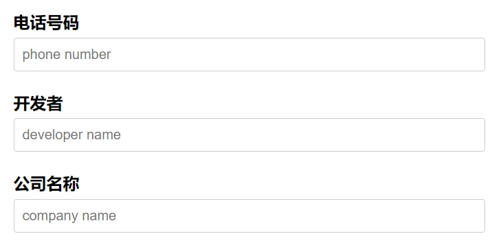
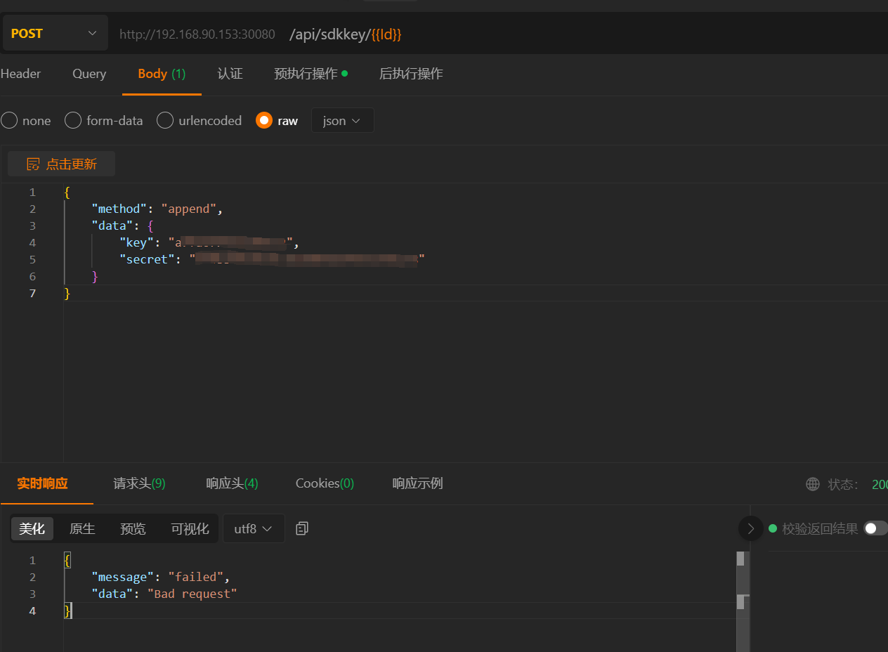

# 01 — SDK Kaydı ve Başlangıç: SDK Key & SDK Secret Almak

> [!CAUTION]
> ## ⚠️ Bu Adım Atlanırsa SDK Çalışmaz
> Huidu SDK'sında **her API çağrısı bir imzayla** gönderilir. İmza ise **`sdkKey`** ve **`sdkSecret`** ile hesaplanır. Bu iki bilgi olmadan **hiçbir API çağrısı kabul edilmez**, cihaz size yanıt vermez.
>
> Yani: kart, ekran veya gateway ne kadar pahalı olursa olsun, **resmi `sdkKey + sdkSecret` çiftini almadan tek satır kod çalıştıramazsınız**.

---

## 📑 İçindekiler

1. [SDK Key ve SDK Secret Nedir?](#1-sdk-key-ve-sdk-secret-nedir)
2. [Niye Bu İki Bilgi Olmadan Hiçbir Şey Yapılamaz?](#2-niye-bu-iki-bilgi-olmadan-hiçbir-şey-yapılamaz)
3. [Kayıt: Huidu / Huayu ile İletişime Geçme](#3-kayıt-huidu--huayu-ile-iletişime-geçme)
4. [Kayıt Formunda İstenen Bilgiler (Türkçe)](#4-kayıt-formunda-i̇stenen-bilgiler-türkçe)
5. [Anahtarları Aldıktan Sonra: Cihaza Yazma](#5-anahtarları-aldıktan-sonra-cihaza-yazma)
6. [İmza Mekanizması (HMACMD5) Özeti](#6-i̇mza-mekanizması-hmacmd5-özeti)
7. [Güvenlik Uyarıları](#7-güvenlik-uyarıları)
8. [Yaygın Hatalar ve Çözümleri](#8-yaygın-hatalar-ve-çözümleri)
9. [SSS](#9-sss)

---

## 1. SDK Key ve SDK Secret Nedir?

| Bilgi | Ne işe yarar | Örnek format | Görünür mü? |
|---|---|---|---|
| **`sdkKey`** | Geliştirici kimliği — sizi diğer geliştiricilerden ayıran herkese açık bir kullanıcı adı gibi | `a7fa6795aaa891e2` (16 karakter hex) | ✅ HTTP başlığında **açık** gider |
| **`sdkSecret`** | Anahtar — istek imzalamak için kullanılan **gizli parola** | `xxxxxxxxxxxxxxxxxxxxx` (uzun string) | ❌ **Hiçbir zaman gönderilmez**, sadece imza üretmek için yerelde tutulur |

**Benzetme:** `sdkKey` posta zarfının üstündeki gönderici adınız, `sdkSecret` ise zarfı mühürlerken kullandığınız özel damga. Damga başkasının eline geçerse adınıza sahte mühürlü zarf gönderilebilir.

> 📌 Bu iki bilgi **birlikte çalışır**. Birini bilip diğerini bilmemek hiçbir işe yaramaz.

---

## 2. Niye Bu İki Bilgi Olmadan Hiçbir Şey Yapılamaz?

Huidu cihazlarındaki HTTP API (`127.0.0.1:30080/api/...`) ve cloud API (`sdk.huidu.cn`), gelen her isteği şu kontrole tâbi tutar:

```
1. İstekte sdkKey başlığı var mı?         → yoksa 401 Unauthorized
2. sdkKey sisteme kayıtlı mı?              → değilse 403 Forbidden
3. İstekteki sign başlığı,
   HMACMD5(body + sdkKey + date, sdkSecret) hesabıyla eşleşiyor mu?  → eşleşmiyorsa 403 Forbidden
4. date başlığı çok eski/ileri mi? (replay saldırısı koruması)        → uygun değilse reddedilir
```

Yani:

- **`sdkKey` yoksa** → istek anlamlandırılamaz, "kim sin sen?" der
- **`sdkSecret` yoksa** → imza üretemezsiniz, doğru `sdkKey` bilseniz bile mühürünüz yok demektir
- **Yanlış `sdkSecret` ile imza üretirseniz** → cihaz "sahte mühür" diyerek reddeder

### Bu mekanizma neden var?

1. **Kimlik doğrulama** — yetkisiz uygulamaların reklamlarınıza müdahale etmesini engeller
2. **Veri bütünlüğü** — istek yolda değişirse imza tutmaz, reddedilir
3. **Log takibi** — sahada yüzlerce ekran arasında "şu komutu kim gönderdi?" sorusunun cevabı
4. **Replay koruması** — eski bir isteği yakalayıp tekrar oynatmak işe yaramaz

---

## 3. Kayıt: Huidu / Huayu ile İletişime Geçme

> [!WARNING]
> Resmi dokümandan birebir alıntı:
>
> **"The platform is not yet open for early access. Please provide the following information to contact Huayu to obtain your SDK Key and SDK Secret."**
>
> **Türkçesi:** *"Geliştirici platformu henüz erken erişime açık değildir. SDK Key ve SDK Secret'inizi almak için lütfen aşağıdaki bilgileri sağlayarak Huayu ile iletişime geçin."*

Yani şu an Huidu'nun **otomatik bir self-service kayıt sayfası yok**. Anahtarlarınızı almak için **manuel olarak Huidu firmasının yetkilileriyle iletişime geçmeniz** gerekiyor.

### İletişim Yolları

| Kanal | Adres / Detay |
|---|---|
| 🌐 **Resmi web sitesi** | http://www.huidu.cn — "Contact Us / 联系我们" bölümü |
| 📧 **E-posta (genel)** | Resmi sitedeki iletişim formundan |
| 🛒 **Cihazı satın aldığınız bayi / distribütör** | Türkiye'de cihazı satan firma genelde anahtarları alma sürecinde aracılık yapar — en hızlı yol budur |
| 💬 **WeChat / QQ** | Çince konuşan ekipler için resmi sitedeki QR kodlar |
| 📞 **Telefon (Çin)** | +86 (Shenzhen) — resmi sitede listeli |
| 🐙 **Gitee Issue** | https://gitee.com/szhuidu/cn.huidu.device.sdk/issues — son çare, yanıt yavaş olabilir |

> 💡 **Türkiye'den önerilen yol:** Cihazı aldığınız bayiyle konuşun. Bayi genelde Huidu ile Çince yazışıp anahtarları kısa sürede temin eder. Doğrudan İngilizce/Türkçe yazışmak günler sürebilir.

---

## 4. Kayıt Formunda İstenen Bilgiler (Türkçe)

Kayıt için Huidu size aşağıdaki bilgileri gönderecektir. Çince formun Türkçe karşılıkları:



| Çince alan | Pinyin / Okunuş | Türkçe karşılığı | Açıklama |
|---|---|---|---|
| **电话号码** | diànhuà hàomǎ | **Telefon numarası** | Ulaşabilecekleri telefon — uluslararası formatta verin (örn. `+90 5XX XXX XX XX`) |
| **开发者** | kāifāzhě | **Geliştirici adı** | Yazılımı geliştirecek kişinin adı veya ekip adı |
| **公司名称** | gōngsī míngchēng | **Şirket adı** | Tam yasal şirket unvanı (örn. *XYZ Reklam A.Ş.*) |

### Genellikle Ek Olarak İstenebilecekler

| Çince olası alan | Türkçe | Niçin sorulur |
|---|---|---|
| 邮箱 / 电子邮件 | E-posta adresi | SDK Key/Secret bu adrese gönderilir |
| 公司地址 | Şirket adresi | Kurumsal müşteri doğrulaması |
| 使用场景 | Kullanım senaryosu | Hangi tür ekranlar / kaç adet cihaz ile çalışılacak (reklam panoları, mağaza içi ekranlar, taksi LED'leri vb.) |
| 设备型号 | Cihaz modeli | C16L, A3, A4, H4K, H8, B8L vb. |
| 设备数量 | Cihaz sayısı | Yaklaşık |
| 国家 / 地区 | Ülke / bölge | Türkiye |

### Türkçe Örnek E-posta Şablonu (İngilizce — Çinli destek personelinin anlayacağı şekilde)

```
Subject: Request for SDK Key and SDK Secret

Hello Huidu / Huayu Team,

We are integrating Huidu LED controllers into our software in Turkey.
Could you please issue an SDK Key and SDK Secret for our developer account?

Phone:        +90 5XX XXX XX XX
Developer:    [Geliştirici adı]
Company:      [Şirket tam adı]
Email:        [E-posta]
Country:      Turkey
Devices:      [Model: C16L / A3 / H4K ...]  approx. [adet]
Use case:     [Örn. Indoor digital signage / outdoor LED billboards / queue display]

Thank you.
[İmza]
```

---

## 5. Anahtarları Aldıktan Sonra: Cihaza Yazma

`sdkKey` ve `sdkSecret`'ı aldığınızda, **bunları cihaza bir kez yazmanız** gerekir. **Bir kez** — bu çok önemli.

> [!CAUTION]
> ## 🚨 Cihaza Sadece Bir Kere Yazılabilir
>
> Resmi dokümandan: *"Once initialized, it cannot be initialized again. Only one addition is permitted to prevent arbitrary additions."*
>
> **Türkçesi:** *"Bir kez başlatıldıktan sonra tekrar başlatılamaz. Keyfi eklemeleri önlemek için yalnızca bir kez eklemeye izin verilir."*
>
> Yani yanlış `sdkKey/sdkSecret` yazarsanız, **cihazı fabrika ayarlarına döndürmeden** düzeltemezsiniz.

### Yöntem 1: Web Arayüzü ile (Önerilen — daha güvenli)

1. Cihazın IP adresini öğrenin (örn. `192.168.1.50`)
2. Tarayıcıdan açın: `http://<cihazIP>:30080/login/`
3. Açılan sayfada `sdkKey` ve `sdkSecret` alanlarını doldurun, kaydedin


> 💡 Eğer sayfa açılmazsa **farklı bir tarayıcı deneyin** (Chrome / Edge / Firefox). Resmi doküman bu noktayı özellikle belirtmiş.

### Yöntem 2: HTTP API ile (otomasyon için)

`/api/sdkkey/` endpoint'ine bir POST isteği gönderilir. **İmza gerektirmez** (henüz secret yoksa imza üretemezsiniz — bu chicken-and-egg sorununu Huidu özel olarak çözmüş).

```http
POST http://<cihazIP>:30080/api/sdkkey/
Content-Type: application/json

{
  "sdkKey": "a7fa6795aaa891e2",
  "sdkSecret": "BURAYA-GERCEK-SECRET-GELIR"
}
```

#### Eğer Daha Önce Yazılmışsa

API şu hatayı verir:



Bu durumda iki seçenek vardır:

1. Cihazı **fabrika ayarlarına döndür** (cihaz manüelinde yazan donanım sıfırlama prosedürü)
2. Mevcut `sdkKey/sdkSecret`'i öğren ve onu kullan (sizin değilse Huidu'ya başvurun)

---

## 6. İmza Mekanizması (HMACMD5) Özeti

Anahtarları aldınız ve cihaza yazdınız. Şimdi her API çağrısı şu kuralı uygular:

### Kural 1 — Genel (çoğu endpoint için)

```
sign = HMACMD5(body + sdkKey + date, sdkSecret)
```

- `body` — istek gövdesindeki tüm JSON içerik (boşluk dahil)
- `sdkKey` — geliştirici kimliğiniz
- `date` — istemcinin şu anki UTC saati (HTTP `Date` başlığı formatında)
- `sdkSecret` — HMAC anahtarı, gönderilmez

### Kural 2 — Sadece Dosya API'sı için

```
sign = HMACMD5(sdkKey + date, sdkSecret)
```

Dosya yükleme/indirme endpoint'lerinde body büyük olduğu için body imzaya katılmaz.

### Örnek HTTP Başlıkları

```http
requestId: da7ddf89-c102-4fb4-95e7-a8f7a72e697e
sdkKey:    a7fa6795aaa891e2
date:      Wed, 09 Aug 2023 07:27:44 GMT
sign:      371b45207ecc8ea993a1468caf7d8bec
Content-Type: application/json
```

### Türkçe Yorumlu PowerShell Örneği

```powershell
function New-HuiduSignature {
    param(
        [Parameter(Mandatory)] [string]$Body,       # Boş olabilir
        [Parameter(Mandatory)] [string]$SdkKey,
        [Parameter(Mandatory)] [string]$SdkSecret,
        [Parameter(Mandatory)] [string]$DateHeader  # "Wed, 09 Aug 2023 07:27:44 GMT" formatinda
    )
    # Kural 1: imzalanacak metin = body + sdkKey + date
    $payload = $Body + $SdkKey + $DateHeader

    # HMACMD5 hesapla
    $hmac = New-Object System.Security.Cryptography.HMACMD5
    $hmac.Key = [System.Text.Encoding]::UTF8.GetBytes($SdkSecret)
    $hash = $hmac.ComputeHash([System.Text.Encoding]::UTF8.GetBytes($payload))

    # Hex string olarak don
    return ([BitConverter]::ToString($hash) -replace '-', '').ToLowerInvariant()
}

# Kullanım:
$now  = (Get-Date).ToUniversalTime().ToString('R')   # "Wed, 09 Aug 2023 07:27:44 GMT"
$body = '{"hello":"world"}'
$sign = New-HuiduSignature -Body $body -SdkKey 'a7fa6795aaa891e2' `
                            -SdkSecret $env:HUIDU_SDK_SECRET -DateHeader $now
```

---

## 7. Güvenlik Uyarıları

> [!IMPORTANT]
> ### 🔐 `sdkSecret` HAKKINDA KURALLAR
>
> 1. **Asla kaynak kodda saklamayın** — git'e push edilmemeli
> 2. **Kişisel cihazlarda Windows Credential Manager / macOS Keychain** kullanın
> 3. **Sunucuda environment variable** olarak tutun (`HUIDU_SDK_SECRET=...`)
> 4. **Hiçbir loga yazmayın** — debug çıktısında bile maskeleyin (`***`)
> 5. **Müşteriye / bayiye gönderirken şifreli kanal** kullanın (e-posta düz metin değil)
> 6. **Sızdığını fark ederseniz** Huidu'dan yeni bir Secret talep edin, eskisini iptal ettirin
> 7. **Frontend / JavaScript / mobil uygulamada gömmeyin** — istemci tarafı her zaman çözülebilir; imzayı backend'de üretin

### Önerilen .env Kullanımı (örnek)

```bash
# .env (asla git'e commit edilmez)
HUIDU_SDK_KEY=a7fa6795aaa891e2
HUIDU_SDK_SECRET=...gercek-secret...
```

```powershell
# Windows: kullanıcı bazlı env variable
[System.Environment]::SetEnvironmentVariable('HUIDU_SDK_KEY','a7fa6795aaa891e2','User')
[System.Environment]::SetEnvironmentVariable('HUIDU_SDK_SECRET','...','User')
```

---

## 8. Yaygın Hatalar ve Çözümleri

| Hata Mesajı / HTTP Kodu | Olası Sebep | Çözüm |
|---|---|---|
| `401 Unauthorized` | İstekte `sdkKey` başlığı yok | HTTP başlıklarına `sdkKey: ...` ekleyin |
| `403 Forbidden` — "invalid sign" | İmza yanlış üretilmiş | `body + sdkKey + date` sırasını kontrol edin; `sdkSecret`'ın doğru olduğundan emin olun |
| `403 Forbidden` — "date out of range" | İstemci saati cihaz saatinden çok farklı | İstemci ve cihaz saatini NTP ile senkronize edin (max ~5 dk fark) |
| `404 Not Found` — `/api/sdkkey/` | Eski firmware | Cihazı en son firmware'e güncelleyin (özellikle Android serisi: A3L, A4L, A5L, A6L, H4K, H8, B8L, A7, A8) |
| "already initialized" | Cihaza önceden başka `sdkKey` yazılmış | Bkz. **Bölüm 5 — Yöntem 2** sonu (fabrika ayarlarına dön veya mevcut secret'ı kullan) |
| Bağlantı timeout | Cihaza ağ üzerinden erişilemiyor | `ping <cihazIP>` test edin; firewall 30080 portunu açın |
| Sayfa açılmıyor (`/login/`) | Tarayıcı uyumsuzluğu | Farklı tarayıcı deneyin (Chrome / Edge / Firefox) |

---

## 9. SSS

### S: Birden fazla cihazım için tek bir `sdkKey/sdkSecret` çifti yeterli mi?

**E:** Evet. Bir geliştirici hesabı tek bir anahtar çiftine sahiptir; bu çift sahip olduğunuz **tüm cihazlara** aynı şekilde yazılır. Cihaz başına ayrı kayıt **gerekmez**.

### S: Anahtarımı kaybedersem ne olur?

**E:** Huidu'ya yeniden başvurmanız gerekir. Cihaza eski secret yazıldıysa ve doğru olanı bilmiyorsanız o cihazı fabrika ayarlarına döndürmek zorunda kalabilirsiniz.

### S: Test ortamı için ayrı anahtar verir miyim?

**E:** Resmi olarak ayrı bir "sandbox" yok. Aynı anahtarı hem geliştirme hem üretim için kullanırsınız — bu yüzden güvenlik ekstra önemlidir.

### S: Anahtarsız test edebilir miyim?

**E:** Kısmen — `/api/sdkkey/` endpoint'i hariç tüm endpoint'ler imza ister. Yani sadece "cihaz başlatma" çağrısını anahtarsız test edebilirsiniz, başka bir şeyi değil.

### S: Cihazlar internet olmadan da çalışır mı?

**E:** Evet. Cihaz lokal API'sı `127.0.0.1:30080` (veya cihazın LAN IP'si) üzerinden çalışır. Cloud API (`sdk.huidu.cn`) sadece uzaktan yönetim için gereklidir.

### S: SDK Key formatı ne kadar uzun olur?

**E:** Genelde **16 karakter hexadecimal** (`a7fa6795aaa891e2` gibi). SDK Secret daha uzundur ve özel karakterler içerebilir.

### S: Aynı anahtarı bir başkasına verirsem?

**E:** **Vermeyin.** O kişi sizin adınıza her cihazınızı yönetebilir. SDK Secret = şirket ağına root parola gibidir.

---

## 🔙 Geri Dön

- [BENIOKU.md](../BENIOKU.md) — Ana belge
- [README.md](../README.md) — Hızlı özet
- [`master` branch'inde orijinal SDK kodu](https://github.com/Turkmen87ai/huidu-sdk-gitee-mirror/tree/master)
- [Resmi Gitee deposu](https://gitee.com/szhuidu/cn.huidu.device.sdk)

---

📝 **Belge geçmişi**
- 2026-05-17 — İlk sürüm. Resmi Huidu README.en.md'deki Bölüm 2.3 ve 2.4 referans alınarak hazırlandı. Görseller orijinal SDK'nın `doc/images/` klasöründen kopyalandı.

💌 **Soru / katkı:** turkmen87ai@gmail.com veya [GitHub Issues](https://github.com/Turkmen87ai/huidu-sdk-gitee-mirror/issues)
