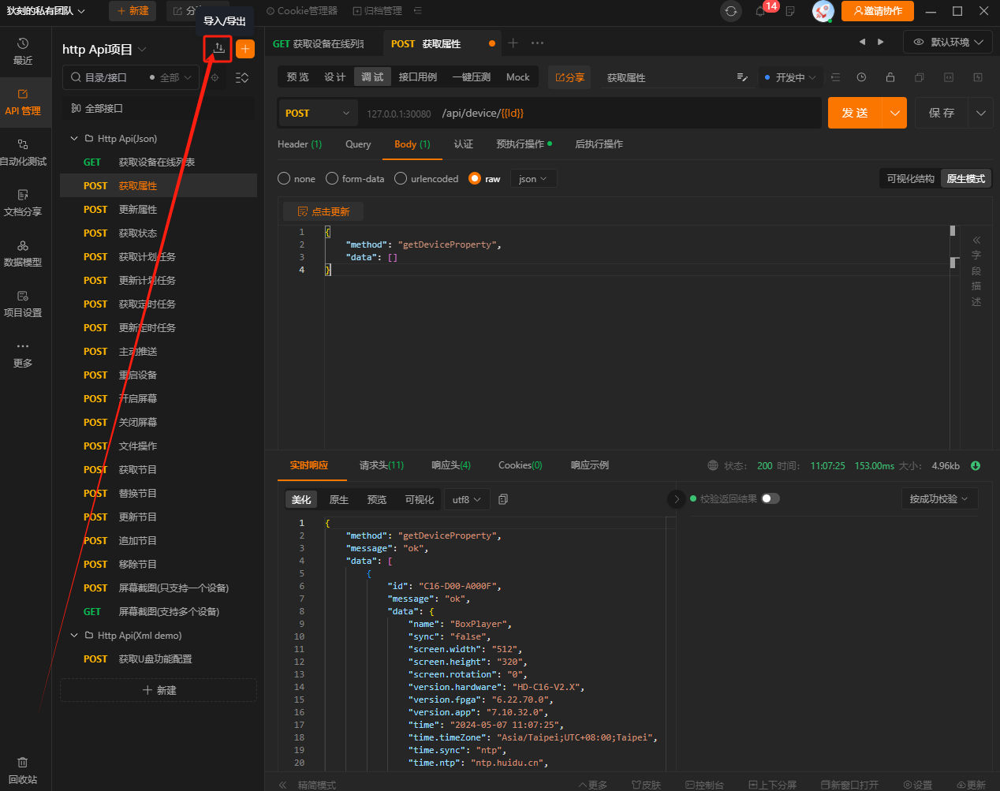
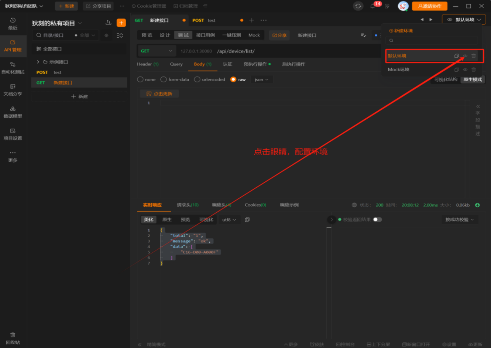
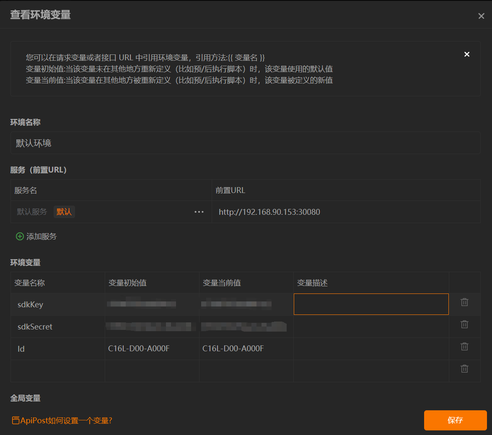
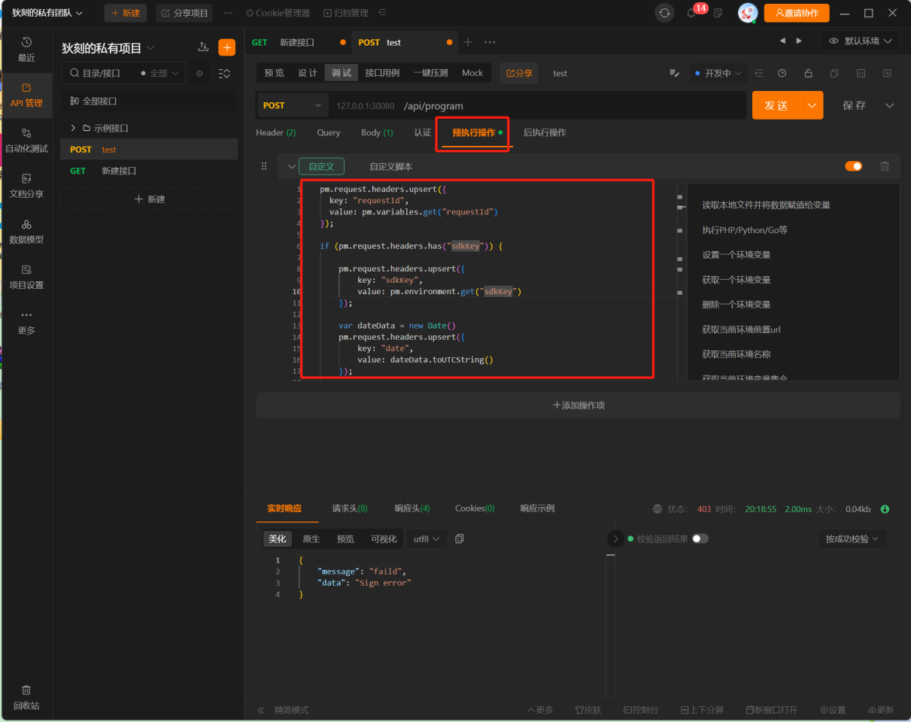

# 02 — SDK Testi Açmak ve Cihaza Bağlanmak

> [!NOTE]
> Bu rehber, **[01-sdk-kayit-ve-baslangic.md](01-sdk-kayit-ve-baslangic.md)** adımını tamamladığınızı varsayar. Elinizde `sdkKey` ve `sdkSecret` olmalı; eğer hâlâ yoksa önce o rehbere dönün.

Bu doküman, anahtarlarınızı aldıktan sonra **ilk başarılı API çağrısını yapana kadar** geçen sürecin tamamını anlatır. Adımlar şu sırada:

```
Cihaz seçimi → Ağ kontrolü → HTTP API'yi cihazda etkinleştir → Test aracı kur (Apipost) → İmza scriptini içe aktar → İlk çağrıyı yap
```

---

## 📑 İçindekiler

1. [Ön Koşullar — Cihaz, Ağ, Firmware](#1-ön-koşullar--cihaz-ağ-firmware)
2. [Cihazın IP Adresini Bulma](#2-cihazın-ip-adresini-bulma)
3. [Cihaza Erişimi Kontrol Etme](#3-cihaza-erişimi-kontrol-etme)
4. [HTTP API'yi Cihazda Etkinleştirme (önemli!)](#4-http-apiyi-cihazda-etkinleştirme-önemli)
5. [Apipost Kurulumu ve Koleksiyon İçe Aktarma](#5-apipost-kurulumu-ve-koleksiyon-i̇çe-aktarma)
6. [Environment Variable Kurma — `sdkKey`, `sdkSecret`, IP](#6-environment-variable-kurma--sdkkey-sdksecret-ip)
7. [İmza Üretimi (Pre-Request Script)](#7-i̇mza-üretimi-pre-request-script)
8. [İlk Başarılı API Çağrısı](#8-i̇lk-başarılı-api-çağrısı)
9. [Postman Kullanmak İsteyenler İçin Notlar](#9-postman-kullanmak-i̇steyenler-i̇çin-notlar)
10. [PowerShell ile Hızlı Manuel Test](#10-powershell-ile-hızlı-manuel-test)
11. [Sıkıntı Çözme (Troubleshooting)](#11-sıkıntı-çözme-troubleshooting)
12. [Hızlı Kontrol Listesi (Checklist)](#12-hızlı-kontrol-listesi-checklist)

---

## 1. Ön Koşullar — Cihaz, Ağ, Firmware

### 1.1 Cihaz Model ID'nizi Kontrol Edin

Huidu SDK, **sadece "engineering card" (geliştirici kartı)** olarak işaretlenmiş cihazlarda çalışır. Ayırt edici özellik: **model ID'sinin ortasında `D` harfi** olması.

| Örnek model | SDK destekler mi? |
|---|---|
| `C16L-D00-A000F`     | ✅ Evet (`D` ortasında) |
| `C16L-A00-A000F`     | ❌ Hayır (standart kart) |


> Cihazın etiketine bakın veya HDPlayer/HDSet yazılımında "Device Info / 设备信息" altında görün. Eğer modelinizde `D` yoksa **anahtar yazsanız bile SDK çağrıları çalışmaz** — bayinizden engineering card talep edin.

### 1.2 Firmware Sürümü

**Android serisi cihazlarınız** varsa (A3L, A4L, A5L, A6L, H4K, H8, B8L, A7, A8 vb.) bir sonraki adıma (HTTP API etkinleştirme — Bölüm 4) geçmeden önce **firmware'i en son sürüme güncelleyin**. Resmi doküman bunu özellikle vurgulamıştır:

> *"Just upgrade to the latest firmware for the Android series and skip this step."*
> **Türkçesi:** Android serisi için sadece firmware'i en son sürüme güncelleyin, bu adımı (HTTP SDK etkinleştirme) atlayın.

**Standart seri (ARM/Linux)** cihazlarınız varsa (C16L, C08L, D16, D36 vb.) HTTP API'yi manuel olarak etkinleştirmeniz gerekir (Bölüm 4'e bakın).

### 1.3 Ağ Konumu

Cihaz ile bilgisayarınız **aynı ağda** olmalıdır:

- Aynı router'a kablo / Wi-Fi ile bağlı
- Veya birbirini görebilecek subnet'lerde
- VPN ardındaysanız, VPN'in cihazın bulunduğu ağa erişimi olmalı
- Cihaz GSM modemde / 4G/5G ile internete çıkıyorsa **LAN üzerinden erişemezsiniz** (uzaktan erişim için sunucu modu gerekir — ayrı konu)

### 1.4 Firewall

Bilgisayarınızdan cihaza **TCP/30080 portu** açık olmalı. Şirket ağında firewall varsa IT'ye danışın.

---

## 2. Cihazın IP Adresini Bulma

### Yöntem 1: HDPlayer / HDSet ile LAN tarama (en kolay)

Huidu'nun resmi yazılımları (HDPlayer, HDSet) açıldığında LAN üzerinde **broadcast paketi** atar ve aynı ağdaki tüm Huidu cihazlarını listeler:

```
Device Name   |   Model   |   IP Address     |   MAC                |   Firmware
LED-Tabela-1  |   C16L-D  |   192.168.1.50   |   D8:80:39:XX:XX:XX  |   v3.5.2
```

### Yöntem 2: Router yönetim paneli (DHCP listesi)

Router'ınızın yönetim arayüzüne girin (genelde `192.168.1.1`). "DHCP Clients" / "Connected Devices" listesinde, MAC adresi **D8:80:39** ile başlayan cihazlar Huidu olabilir (üretici OUI).

### Yöntem 3: ARP scan (PowerShell)

```powershell
# Aktif arp tablosu - Huidu MAC prefix
arp -a | Select-String 'd8-80-39'
```

### Yöntem 4: nmap (gelişmiş)

```powershell
# 30080 portu açık olan tüm cihazlar
nmap -p 30080 --open 192.168.1.0/24
```

---

## 3. Cihaza Erişimi Kontrol Etme

IP'yi öğrendikten sonra üç şeyi sırayla doğrulayın:

### 3.1 Ping

```powershell
Test-Connection 192.168.1.50 -Count 4
# veya
ping 192.168.1.50
```

✅ Yanıt geliyorsa cihaz ağda ve sizden ulaşılabilir.

❌ Yanıt gelmiyorsa: kablo / Wi-Fi / VLAN / firewall sorunu — bu adıma dön ve düzelt.

### 3.2 Port 30080 Açık mı?

```powershell
Test-NetConnection 192.168.1.50 -Port 30080
```

Beklenen çıktı:
```
TcpTestSucceeded : True
```

❌ `TcpTestSucceeded : False` görüyorsanız: cihaz ağda var ama HTTP API çalışmıyor. Bölüm 4'e geçin (HTTP API'yi etkinleştirme).

### 3.3 Browser'dan Cihaz Sayfası Açılıyor mu?

Tarayıcıya yazın:
```
http://192.168.1.50:30080/login/
```

✅ Bir login/init sayfası gözükmeli (Bölüm 5 — Yöntem 1 — webPageInit.png'deki sayfa).

❌ Açılmıyorsa: **farklı bir tarayıcı deneyin** (Chrome / Edge / Firefox). Resmi doküman tarayıcı uyumsuzluğunun yaygın olduğunu söylemiştir.

---

## 4. HTTP API'yi Cihazda Etkinleştirme (önemli!)

> [!IMPORTANT]
> ### Hangi Cihazlarda Bu Adım Gerekli?
>
> | Cihaz serisi | Bu adım | Neden |
> |---|---|---|
> | **Android serisi** (A3L, A4L, A5L, A6L, H4K, H8, B8L, A7, A8 ...) | ❌ Gerek yok — sadece firmware'i en son sürüme güncelleyin | HTTP API zaten varsayılan olarak açık geliyor (yeni firmware'larda) |
> | **Standart seri (ARM/Linux)** (C16L, C08L, D16, D36 ...) | ✅ Manuel etkinleştirme zorunlu | Varsayılan kapalı; aşağıdaki XML komutu ile açılmalı |

### 4.1 Önce SDK_Test Aracını İndirin

Resmi SDK içinde `tools/SDK_Test.rar` olarak gelir. Çıkartınca içinde **SDK_Test.exe** olur. Bu eski tip TCP/XML tabanlı SDK — yeni HTTP API'yi etkinleştirmek için kullanılır (chicken-and-egg: HTTP API kapalıyken HTTP üzerinden açamazsınız).

> **Yerinden ulaşmak:** [`master` branch'inde `tools/SDK_Test.rar`](https://github.com/Turkmen87ai/huidu-sdk-gitee-mirror/blob/master/tools/SDK_Test.rar) (orijinal kaynak: Huidu Gitee)
>
> Aynı klasörde Çince operasyon kılavuzu da var: `SDK_Test操作说明.docx`

### 4.2 HTTP API Durumunu Sorgulama

SDK_Test'i açın, cihaza bağlanın (cihazın IP'sini girin), aşağıdaki XML'i gönderin:

```xml
<?xml version='1.0' encoding='utf-8'?>
<sdk guid="##GUID">
    <in method="GetHttpApiEnable"/>
</sdk>
```

Cevap eğer `enable="true"` ise HTTP API zaten açık, devam edebilirsiniz:

```xml
<?xml version="1.0" encoding="utf-8"?>
<sdk guid="19aa000a54d79ce835655d855f109a97">
    <out result="kSuccess" method="GetHttpApiEnable">
        <func enable="true"/>
    </out>
</sdk>
```

### 4.3 HTTP API'yi Etkinleştirme

Eğer `enable="false"` döndüyse aşağıdaki komutla açın:

```xml
<?xml version='1.0' encoding='utf-8'?>
<sdk guid="##GUID">
    <in method="SetHttpApiEnable">
        <func enable="true"/>
    </in>
</sdk>
```

Başarı cevabı:

```xml
<?xml version="1.0" encoding="utf-8"?>
<sdk guid="7b1b1e7dba5363fc651dc1dc72f949d5">
    <out method="SetHttpApiEnable" result="kSuccess"/>
</sdk>
```

> [!WARNING]
> ### 🚨 HTTP SDK Etkinleştirmenin Yan Etkisi
>
> Resmi dokümandan: *"Enabling the HTTP SDK will take over certain standard functions to ensure full HTTP control. After enabling it, some settings in other software (e.g., HDPlayer) may not take effect, such as scheduled power on/off."*
>
> **Türkçesi:** HTTP SDK'yı etkinleştirmek, tam HTTP kontrolünü sağlamak için **bazı standart işlevleri devralır.** Bu işlemden sonra **HDPlayer gibi diğer yazılımlardaki bazı ayarlar** (ör. zamanlı aç/kapa) **artık etki etmeyebilir.**
>
> Yani: bu cihazı bundan sonra **sadece SDK üzerinden** yöneteceksiniz. HDPlayer + SDK karışık kullanımı yapacaksanız öncesinde test edin.

---

## 5. Apipost Kurulumu ve Koleksiyon İçe Aktarma

Apipost, Çinli ekibin Postman muadili olarak geliştirdiği bir REST API test aracıdır. Huidu, **hazır bir API koleksiyonu** (Apipost formatında) sağlamıştır — içinde tüm endpoint'ler, imza scripti ve örnek istekler bulunur.

### 5.1 Apipost'u İndir

Resmi indirme: **https://www.apipost.cn/**

Windows için `.exe`, macOS için `.dmg`. Ücretsiz sürüm günlük kullanım için yeterlidir.

> 💡 **Apipost yerine Postman kullanmak istiyorsanız** Bölüm 9'a geçin — Huidu Postman koleksiyonu da sağlamıştır.

### 5.2 Hazır Koleksiyonu İçe Aktarma

Resmi SDK içinde `doc/HD_HttpApi1.0_Apipost_Collection.json` dosyası vardır. Bu dosyayı Apipost'a yükleyin:

1. Apipost'u açın
2. Sol üst köşeden **Import / 导入** butonuna tıklayın
3. Dosya seçimine `HD_HttpApi1.0_Apipost_Collection.json`'ı verin




İçe aktarma tamamlanınca sol panelde Huidu'nun tüm endpoint kategorileri görünür:

- Universal Device Interface (cihaz bilgisi, restart, vb.)
- Program Interface (program/sayfa yükleme, silme)
- File Interface (dosya yükleme, indirme)
- ve diğerleri

> **Yerinden almak:** [`master` branch'inde `doc/HD_HttpApi1.0_Apipost_Collection.json`](https://github.com/Turkmen87ai/huidu-sdk-gitee-mirror/blob/master/doc/HD_HttpApi1.0_Apipost_Collection.json)

---

## 6. Environment Variable Kurma — `sdkKey`, `sdkSecret`, IP

Apipost'un environment (ortam değişkeni) özelliğini kullanarak `sdkKey` ve `sdkSecret`'ı tek bir yerde tutarsınız — böylece her istekte tek tek girmek zorunda kalmazsınız.

### 6.1 Yeni Environment Oluşturma



Sağ üstte **Environment / 环境** düğmesine tıklayın → **New Environment** seçin → ismini "Huidu - Production" gibi koyun.

### 6.2 Server IP, Port ve Anahtarları Yazma



Aşağıdaki değişkenleri oluşturun:

| Değişken adı | Örnek değer | Açıklama |
|---|---|---|
| `serverIp`   | `192.168.1.50` | Cihazın LAN IP'si veya cloud için `sdk.huidu.cn` |
| `serverPort` | `30080`        | Lokal cihazlar için 30080; cloud için 443 |
| `sdkKey`     | `a7fa6795aaa891e2` | Huidu'dan aldığınız geliştirici kimliği |
| `sdkSecret`  | `***`           | Huidu'dan aldığınız gizli anahtar — kimseyle paylaşmayın |

> 🔒 **Güvenlik:** Apipost environment'ı `.apipost` klasöründe yerel olarak saklanır. **Bu dosyayı bir başkasıyla paylaşmayın, git'e commit etmeyin.**

---

## 7. İmza Üretimi (Pre-Request Script)

Her API çağrısının başlığında **otomatik HMACMD5 imzası** olması gerekir. Apipost'un "Pre-Action / Pre-Request Script" özelliği bu hesaplamayı her istek öncesi otomatik yapar.

### 7.1 Pre-Action Sekmesini Açın



Koleksiyonun "Pre-Action" sekmesine girin ve aşağıdaki scripti yapıştırın (zaten hazır koleksiyonda var, sadece kontrol edin):

```javascript
pm.request.headers.upsert({
    key: "requestId",
    value: pm.variables.get("requestId")
});

if (pm.request.headers.has("sdkKey")) {
    pm.request.headers.upsert({ key: "sdkKey", value: pm.environment.get("sdkKey") });

    var dateData = new Date();
    pm.request.headers.upsert({ key: "date", value: dateData.toUTCString() });

    var signText = pm.environment.get("sdkKey") + dateData.toUTCString();
    if (pm.request.body != undefined && pm.request.body.raw != undefined) {
        signText = pm.request.body.raw + signText;
    }
    var sign = CryptoJS.HmacMD5(signText, pm.environment.get("sdkSecret")).toString();

    pm.request.headers.upsert({ key: "sign", value: sign });

} else if (pm.request.url.query.has("sdkKey")) {
    pm.request.url.query.upsert({ key: "sdkKey", value: pm.environment.get("sdkKey") });

    var dateData = new Date();
    pm.request.url.query.upsert({ key: "date", value: dateData.toUTCString() });

    var signText = pm.environment.get("sdkKey") + dateData.toUTCString();
    if (pm.request.body != undefined && pm.request.body.raw != undefined) {
        signText = pm.request.body.raw + signText;
    }
    var sign = CryptoJS.HmacMD5(signText, pm.environment.get("sdkSecret")).toString();

    pm.request.url.query.upsert({ key: "sign", value: sign });
}
```

### 7.2 Script Ne Yapıyor?

- Her istekten **hemen önce** çalışır
- Geçerli zamanı UTC formatında `date` başlığına yazar
- Environment'tan `sdkKey` ve `sdkSecret`'ı alır
- `body + sdkKey + date` metnini `sdkSecret` ile **HMACMD5** ile imzalar
- İmzayı `sign` başlığına yazar
- Query string'de `sdkKey` olan dosya endpoint'leri için aynı işlemi URL parametrelerinde yapar (Rule 2)

Sayesinde siz hiçbir başlığı manuel yazmazsınız — script her isteği otomatik imzalar.

---

## 8. İlk Başarılı API Çağrısı

Şimdi gerçek bir API çağrısı yapacağız. En basit, yan etkisi olmayan endpoint: **cihaz bilgisi al**.

### 8.1 Koleksiyondan İsteği Seçin

Sol panelden: **Universal Device Interface → Retrieve Device Info** (`GET /api/getDeviceInfo` veya benzeri).

### 8.2 Environment'ın Seçili Olduğundan Emin Olun

Sağ üstte oluşturduğunuz environment ("Huidu - Production") seçili olmalı.

### 8.3 Send Butonuna Tıklayın

Beklenen sonuç (örnek):

```json
{
  "code": 0,
  "msg": "ok",
  "data": {
    "deviceName": "LED-Tabela-1",
    "model": "C16L-D00-A000F",
    "firmware": "v3.5.2",
    "uptime": "5d 12h",
    "...": "..."
  }
}
```

🎉 `code: 0` ve `msg: "ok"` görüyorsanız **SDK çalışıyor demektir.**

### 8.4 Yaygın Hatalar

| Sonuç | Sebep | Çözüm |
|---|---|---|
| `code: 401` veya **timeout** | Cihaza ağdan ulaşılamıyor | Bölüm 3'e dön (ping/port test) |
| `code: 403` "invalid sign" | İmza hatalı | `sdkSecret`'ı kontrol et, environment'a doğru yazdın mı? |
| `code: 403` "date out of range" | Bilgisayar saati cihaz saatinden çok farklı | Saati NTP ile senkronize et (`w32tm /resync` Windows'ta) |
| `404 /api/getDeviceInfo` | Eski firmware, endpoint adı farklı | Firmware'i güncelle veya alternatif endpoint dene |
| HTML cevap geliyor (JSON değil) | İstek HTTP API'ya değil login sayfasına gitti | Endpoint URL'sini kontrol et (`/api/...` ile başlamalı) |

---

## 9. Postman Kullanmak İsteyenler İçin Notlar

Apipost yerine Postman tercih ediyorsanız:

1. **Koleksiyon dosyası:** Resmi SDK içinde `doc/HD_HttpApi1.0_Postman_Collection.json` var, onu kullanın
2. **Pre-Request Script:** Apipost'taki `pm.environment.get(...)` ve `pm.request.headers.upsert(...)` API'ları Postman ile **birebir aynıdır** — değişiklik yapmadan çalışır
3. **CryptoJS modülü:** Postman'in built-in `pm.cryptojs` veya global `CryptoJS` ile gelir (Apipost'la aynı)
4. **Environment kurulumu:** Tamamen aynı (`sdkKey`, `sdkSecret`, `serverIp`, `serverPort`)
5. **Tek farkı:** "Pre-Action" yerine **"Pre-request Script"** sekmesi adıyla geçer

> Eğer Postman kullanırsanız Apipost'a ihtiyacınız yok — script ve koleksiyon birebir uyumlu.

---

## 10. PowerShell ile Hızlı Manuel Test

Hiç GUI aracı kurmadan sadece PowerShell ile cihazı test etmek istiyorsanız:

```powershell
# config (kendi degerlerinizi koyun)
$serverIp   = '192.168.1.50'
$serverPort = 30080
$sdkKey     = 'a7fa6795aaa891e2'
$sdkSecret  = $env:HUIDU_SDK_SECRET   # env'den al, koda yazma

# Endpoint
$path = '/api/getDeviceInfo'
$url  = "http://${serverIp}:${serverPort}$path"

# Imza (body bos - GET istek)
$now      = (Get-Date).ToUniversalTime().ToString('R')   # "Wed, 09 Aug 2023 07:27:44 GMT"
$signText = '' + $sdkKey + $now                          # body bos
$hmac     = New-Object System.Security.Cryptography.HMACMD5
$hmac.Key = [System.Text.Encoding]::UTF8.GetBytes($sdkSecret)
$sign     = ([BitConverter]::ToString(
              $hmac.ComputeHash([System.Text.Encoding]::UTF8.GetBytes($signText))
            ) -replace '-', '').ToLowerInvariant()

# Istek
$headers = @{
    'requestId'    = [Guid]::NewGuid().ToString()
    'sdkKey'       = $sdkKey
    'date'         = $now
    'sign'         = $sign
    'Content-Type' = 'application/json'
}

try {
    $r = Invoke-RestMethod -Uri $url -Method GET -Headers $headers -TimeoutSec 10
    "Basari: $($r | ConvertTo-Json -Depth 5)"
} catch {
    "Hata: $($_.Exception.Message)"
}
```

Bu betiği `huidu-ping.ps1` olarak kaydedip çalıştırırsanız, doğru anahtarlarla cihazdan cevap almalısınız.

> 💡 PowerShell ile çalışırken `sdkSecret`'i env değişkeninden okuyun:
> ```powershell
> [Environment]::SetEnvironmentVariable('HUIDU_SDK_SECRET','gercek-secret','User')
> ```

---

## 11. Sıkıntı Çözme (Troubleshooting)

### Cihaz pinge yanıt veriyor ama port 30080 kapalı

→ HTTP API cihazda etkin değil. **Bölüm 4**'e dön ve `SetHttpApiEnable` ile aç. Android serisi cihazlarda firmware güncellemesini unutma.

### `/login/` sayfası açılıyor ama API çağrıları 404 veriyor

→ Cihaz daha eski bir firmware'da, endpoint adları farklı olabilir. Firmware güncelle. Veya farklı bir endpoint dene (örn. `/api/v1/getDeviceInfo`).

### Apipost koleksiyonu boş içe aktarılıyor

→ JSON dosyası bozuk olabilir. Resmi kaynaktan tekrar indir:
- [GitHub mirror](https://github.com/Turkmen87ai/huidu-sdk-gitee-mirror/blob/master/doc/HD_HttpApi1.0_Apipost_Collection.json)
- [Resmi Gitee](https://gitee.com/szhuidu/cn.huidu.device.sdk/blob/master/doc/HD_HttpApi1.0_Apipost_Collection.json)

### Pre-Action script çalışmıyor (`CryptoJS undefined`)

→ Apipost'un eski sürümü olabilir. Apipost'u güncelleyin (4.x ve üstü `CryptoJS` global olarak sağlar).

### Her istek `code: 403 invalid sign` dönüyor

Sırasıyla kontrol edin:

1. `sdkSecret` environment'ta tamamen doğru mu yazıldı? (kopyalarken trim hatası yapmış olabilirsin — başında/sonunda boşluk var mı?)
2. `sdkKey` ve `sdkSecret` aynı çiftten mi geliyor? (yanlış eşleştirme)
3. Pre-Action script doğru kopyalandı mı? (özellikle `body + sdkKey + date` sırası kritik)
4. Bilgisayar saatiniz cihazınkinden 5 dakikadan fazla mı farklı?

### Cihaz LAN'da ama internet yok — cloud API çalışmıyor

→ Cloud API (`sdk.huidu.cn`) ayrı bir yol; bu rehber lokal API'yi anlatıyor. Lokal API tamamen offline çalışır, cihaz internete bağlanmasa bile sorun değil.

### Cihaz GSM modem üzerinden uzaktan yönetiliyor

→ Bu durumda doğrudan LAN üzerinden cihaza ulaşamazsınız. Huidu'nun "Server Mode" (sunucu modu) yapısı gerekir — cihaz dışarıdaki bir sunucuya bağlanır, siz sunucu üzerinden cihaza komut iletirsiniz. Ayrı bir konu, ileride başka bir rehberde ele alacağız.

---

## 12. Hızlı Kontrol Listesi (Checklist)

Test ortamı kurulum sürecini bu listeye göre tamamlayabilirsiniz:

- [ ] Cihaz model ID'si `D` harfi içeriyor (engineering card)
- [ ] Firmware en güncel (özellikle Android serisi)
- [ ] Cihaz IP adresi biliniyor (`192.168.x.x`)
- [ ] Ping başarılı (`Test-Connection`)
- [ ] Port 30080 açık (`Test-NetConnection`)
- [ ] HTTP API etkin (`/login/` sayfası açılıyor)
- [ ] `sdkKey` ve `sdkSecret` cihaza yazıldı (Rehber 01, Bölüm 5)
- [ ] Apipost (veya Postman) kuruldu
- [ ] Hazır koleksiyon içe aktarıldı (`HD_HttpApi1.0_*_Collection.json`)
- [ ] Environment variables yazıldı (`sdkKey`, `sdkSecret`, `serverIp`, `serverPort`)
- [ ] Pre-Action script var, `CryptoJS` çalışıyor
- [ ] İlk API çağrısı (örn. `getDeviceInfo`) `code: 0` dönüyor 🎉

Tüm maddeler ✅ ise SDK üretime hazır.

---

## 🔙 Sonraki Adımlar

- **Anahtar henüz alınmadıysa** → [01-sdk-kayit-ve-baslangic.md](01-sdk-kayit-ve-baslangic.md)
- **Programlar / sayfalar göndermeyi öğrenmek** → (gelecek rehber: 03-program-gonderme.md)
- **Cihaz parlaklık / zamanlama** → (gelecek rehber: 04-cihaz-yonetimi.md)
- **Server Mode / uzaktan yönetim** → (gelecek rehber: 05-server-mode.md)

📂 **Orijinal SDK kaynak kodu:** [`master` branch](https://github.com/Turkmen87ai/huidu-sdk-gitee-mirror/blob/master/README.en.md)
🔗 **Resmi Gitee deposu:** https://gitee.com/szhuidu/cn.huidu.device.sdk

---

📝 **Belge geçmişi**
- 2026-05-17 — İlk sürüm. Resmi Huidu README.en.md Bölüm 2.2, 2.5 ve 4 referans alınarak hazırlandı. Görseller `master/doc/images/` klasöründen kopyalandı.

💌 **Soru / katkı:** turkmen87ai@gmail.com veya [GitHub Issues](https://github.com/Turkmen87ai/huidu-sdk-gitee-mirror/issues)
